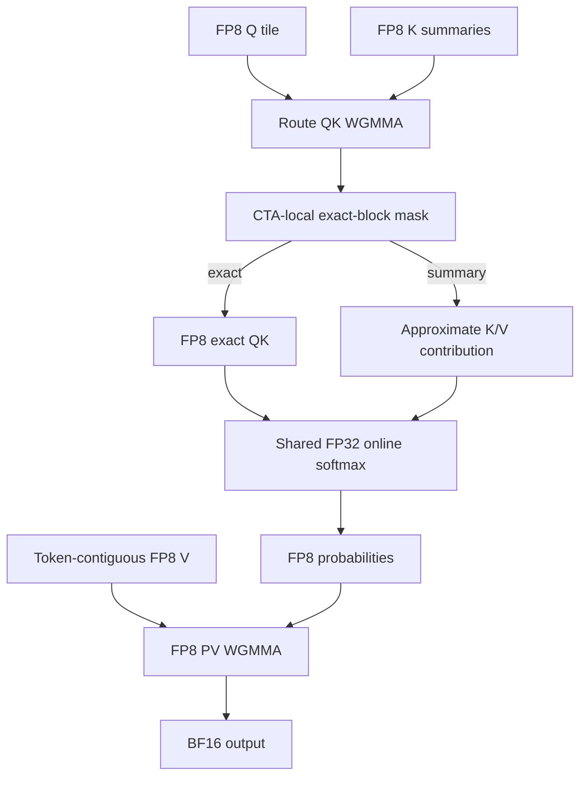
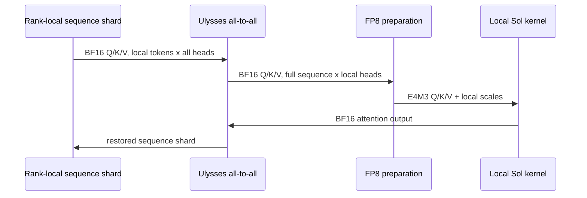

<!-- GENERATED by scripts/build_blog.py; edit sections/*/README.md. -->

[Back to the modular repository index](README.md)

<!--
SECTION-CONTRACT
id: 00-abstract
role: State the thesis, contributions, and only cross-case headline results.
sources: TeleFuser PRs 16, 25, 30, 35, 40, and 44.
edit_scope: Update after any canonical claim changes; do not add unmatched aggregate speedups.
-->

# From Quantization to Quality

## Building an Efficient Video-DiT Inference Stack in TeleFuser

### Abstract

Video diffusion transformers combine large model weights, long spatiotemporal
sequences, iterative denoising, and expensive media decoders. Optimizing one
operator rarely optimizes the system: weight-only compression may save memory
without accelerating attention; sparse attention may reduce FLOPs while adding
workspace; sequence parallelism changes the tensor over which quantization
scales are valid; and a LoRA adapter invalidates a cached quantized weight.

This article presents the evolution of an efficient inference stack in
[TeleFuser](https://github.com/Tele-AI/TeleFuser) through six implementation
case studies. We first introduce online FP8 and NF4 quantization for image and
video DiTs, then specialize it for the 35B-class multimodal MiniMax-H3
transformer. We carry FP8 across the attention boundary with block-scaled Q/K,
channel-scaled V, and a Hopper CuTe Sol-Attn mainloop. We compose that kernel
with Ulysses sequence parallelism, recover part of the quantization error with
an attention-equivalent K/V centering transform, and merge both standard and
hybrid FastH3 adapters before optional FP8 materialization.

The evaluation uses generated images and synchronized video-audio outputs in
addition to latency, throughput, memory, kernel error, and trajectory-similarity
metrics. On a single H100, MiniMax-H3 FP8 Linear + FP8 Sol raises denoising
throughput by 65.0% over BF16 Dense while using 41.9% less peak allocated
memory. On four H100s, TP2 x Ulysses SP2 FP8 Sol raises throughput by 53.2% over
the matched TeleFuser BF16 + FlashAttention-4 baseline and reaches 2.62x the
denoising speed of the deployed LightX2V comparison. Attention smoothing
reduces dense attention-output MSE by 8.18% at a 2.11% throughput cost.
Finally, the adapter path improves throughput by 36.5% for MiniMax-H3 Turbo
relative to LightX2V and by 57.2% for FastH3 relative to FastVideo on their
matched single-H100 workloads.

The central result is methodological: efficient generative inference is a
contract across numerical representation, kernel layout, distributed tensor
ownership, model lifecycle, and quality validation. An optimization is not
complete until those contracts agree.

---

<!--
SECTION-CONTRACT
id: 01-background
role: Explain the cost model and prior techniques without claiming TeleFuser invented them.
sources: MiniMax H3, Sol-Attn, SageAttention2, xDiT, FlashAttention-4, VSA.
edit_scope: Concepts and related work only; case-specific measurements belong later.
-->

# 1. Background

## Why video DiTs are a systems problem

Diffusion transformers repeatedly evaluate a large transformer while denoising
a latent video. Compared with image generation, the temporal axis makes the
attention sequence much longer. MiniMax-H3 adds another systems dimension: one
model produces video and synchronized stereo audio and supports multimodal
conditioning. In the 768p workload studied here, a live attention tensor has
32,626 tokens, 56 heads, and head dimension 128.

The repeated transformer contains two dominant matrix-multiplication families:

1. **Linear GEMMs** in QKV projections, output projections, and feed-forward
   networks.
2. **Attention GEMMs** in
   \(\operatorname{softmax}(QK^T / \sqrt d)V\).

They have different data layouts, scaling requirements, and fusion
opportunities. A 2-D FP8 Linear kernel does not automatically accelerate the
online softmax or the QK/PV path. This distinction drives the architecture in
the later case studies.

## Four complementary efficiency axes

**Low-precision Linear.** Hopper Tensor Cores can accelerate FP8 E4M3 GEMMs.
Dynamic W8A8 inference stores weights in FP8 and quantizes each activation row
at runtime. NF4 instead provides aggressive weight-only compression with BF16
compute. FP8 usually targets throughput and memory together; NF4 primarily
targets capacity.

**Sparse attention.** [Sol-Attn](https://nvlabs.github.io/Sana/Sol-Attn/)
routes important key-value blocks to exact attention and approximates the
remaining blocks inside the same online-softmax state. Unlike a hard drop mask,
the summary route retains a compressed contribution. This makes the sparsity
budget dynamic and avoids materializing a global routing map.

**Distributed sequence ownership.** [xDiT](https://arxiv.org/abs/2411.01738)
shows why diffusion inference benefits from composable parallel dimensions.
Ulysses sequence parallelism applies all-to-all communication so each rank
receives the full sequence for a subset of heads. Ring attention instead keeps
sequence shards local and circulates K/V blocks while merging online-softmax
statistics. Those layouts are mathematically equivalent for dense attention,
but they expose different local tensors to a quantizer and sparse router.

**Model compression and adaptation.** A low-rank adapter changes the effective
weight from \(W\) to \(W + \Delta W\). If a runtime has already cached an FP8
copy of \(W\), applying the adapter afterward leaves the optimized kernel with
stale weights. Adapter support therefore belongs in the quantization lifecycle,
not only in model loading.

## Precision preservation is part of the kernel

Quantized attention is not defined only by a dtype. Scale granularity,
accumulator precision, outlier handling, and algebraic transforms determine the
error. [SageAttention2](https://arxiv.org/abs/2411.10958), for example, combines
low-precision QK/PV kernels with smoothing and fine-grained quantization.
[FlashAttention-4](https://arxiv.org/abs/2603.05451) similarly illustrates that
algorithm and pipeline design must follow the asymmetry of the target hardware.

For diffusion, a small local error can perturb a trajectory and produce a
visually different but still valid sample. We therefore evaluate three levels:

- operator error against a high-precision reference;
- end-to-end performance and peak memory; and
- decoded image, video, and audio evidence.

No one level substitutes for the others.

---

<!--
SECTION-CONTRACT
id: 02-motivation
role: Turn observed deployment failures into the research questions.
sources: Negative and positive results from PRs 16, 25, 30, 35, 40, and 44.
edit_scope: Preserve the distinction between observed evidence and hypotheses.
-->

# 2. Motivation

The project began with a simple deployment request: run models without native
quantized checkpoints on available GPUs. The experiments quickly exposed five
gaps between enabling an optimization and obtaining an efficient system.

## Gap 1: compression is not acceleration

In the Qwen-Image case, online TorchAO FP8 reduced peak allocated memory from
59.47 GiB to 40.48 GiB but increased mean latency from 6.02 s to 8.35 s. BNB
NF4 reduced memory further to 31.30 GiB but also increased latency to 7.75 s.
The result is useful, but it rejects the assumption that a smaller dtype
automatically makes the workload faster. Dynamic quantization, dispatch, and
unsupported matrix shapes remain visible.

## Gap 2: quantized weights leave attention untouched

FP8 Linear produces BF16 Q/K/V. If attention immediately consumes those tensors
through a BF16 backend, the long-sequence QK and PV products still dominate.
Conversely, sparse BF16 attention reduces QK/PV work but retains BF16 model
weights. The first main research question is therefore:

> Can weight/activation quantization and dynamic attention sparsity share an
> FP8 data path without paying dequantization and materialization overhead
> between them?

## Gap 3: distributed layout changes scale semantics

The scale for a Q/K block is meaningful only for the tokens and heads that the
local kernel consumes. Quantizing before a Ulysses all-to-all makes each rank
compute scales over a sequence shard that is later rearranged. The second
question is:

> Where should FP8 preparation occur so that communication, scale granularity,
> and sparse routing describe the same local tensor?

## Gap 4: numerical validity is not perceptual validity

Early all-layer FP8 attention profiles produced visibly degraded videos even
when kernels completed and outputs were finite. Dense prefixes and partial
layer ranges recovered quality, but the final FP8 boundary still introduced
measurable error. This motivates a third question:

> Which precision-preserving transformations are mathematically neutral before
> quantization, and can their runtime cost be fused away?

## Gap 5: optimized weights are mutable

MiniMax-H3 Turbo and FastH3 are distributed as adapters over the same base
model, but their formats differ. Turbo uses standard low-rank tensors, while
FastH3 combines hundreds of low-rank pairs with exact residual deltas. A VSA
variant also contains learned replacement gates. This creates the fourth
question:

> Can the runtime merge all supported updates into the BF16 source of truth,
> quantize the final adapted weights once, and reject unsupported semantics
> rather than silently generating with an incomplete model?

These questions define the optimization ladder evaluated in the next sections.

---

<!--
SECTION-CONTRACT
id: 03-system-overview
role: Define the complete optimization stack and component ownership.
sources: TeleFuser PRs 16, 25, 30, 35, 40, and 44.
edit_scope: Architecture only; do not introduce new benchmark claims here.
-->

# 3. System Overview

TeleFuser separates model-level policy from kernel-level mechanism. The model
loader owns weight mutation and quantization order. The model wrapper owns
dense/sparse dispatch and parallel layout. Public ops own portable contracts.
Architecture-specific kernels own layouts, scaling, and fused execution.

```mermaid
flowchart LR
    C[BF16 checkpoint] --> A[Merge supported adapter deltas in FP32]
    A --> W[Materialize cached E4M3 Linear weights]
    X[BF16 hidden states] --> AQ[Dynamic row-wise FP8 activation quantization]
    W --> G[tf-kernel W8A8 Linear GEMM]
    AQ --> G
    G --> QKV[BF16 Q/K/V]
    QKV --> NR[QK norm and RoPE]
    NR --> U{Ulysses enabled?}
    U -->|yes| AA[All-to-all: full sequence, local heads]
    U -->|no| P[Local Q/K/V]
    AA --> P
    P --> S[Exact K/V statistics and centering]
    S --> F[FP8 Q/K/V preparation]
    F --> SOL[SM90 FP8 Sol routing + QK + online softmax + PV]
    SOL --> O[BF16 output correction and dense-prefix merge]
```

## Ownership boundaries

| Layer | Responsibility | Precision boundary |
|---|---|---|
| Model loading | Read BF16 checkpoint, map adapter keys, merge updates | FP32 merge into BF16 source |
| FP8 Linear wrapper | Cache weight scales, quantize activations, call GEMM | E4M3 x E4M3, BF16 output |
| Parallel wrapper | Apply TP/Ulysses collectives and restore layout | BF16 exchange |
| FP8 attention prep | Smooth, scale, quantize, and relayout Q/K/V | Post-RoPE BF16 to E4M3 |
| Sol mainloop | Route blocks, compute exact/summary attention | E4M3 QK/PV, FP32 accumulate |
| Output boundary | Restore V mean and exact dense prefix | BF16 output |

## The six-step optimization ladder

1. **PR #16: general online quantization.** Add backend-neutral configuration
   and module replacement for TorchAO FP8 and BNB NF4.
2. **PR #25: MiniMax-H3 enablement.** Quantize 258 Linear layers while
   preserving FP32-sensitive projections, encoders, and VAEs.
3. **PR #30: native FP8 attention.** Reuse one activation quantization for QKV,
   prepare attention-specific FP8 operands, and execute Sol in an SM90 CuTe
   mainloop.
4. **PR #35: distributed composition.** Place FP8 preparation after Ulysses
   all-to-all and tune KV splitting and route parameters at long sequence
   lengths.
5. **PR #40: quality recovery.** Center K/V with attention-equivalent
   transforms, correct FP8 V bias, and fuse the added boundaries.
6. **PR #44: adapter-aware weights.** Merge standard and hybrid adapters before
   FP8 conversion and reject unsupported VSA replacement gates.

## Dense islands inside an optimized graph

The fastest valid path is deliberately mixed precision. Text encoders and VAEs
stay in their reference precision. MiniMax-H3 keeps the conditioning prefix
exact, recomputes prefix queries with dense BF16 attention, and protects early
steps and layers. Wan restricts FP8 attention to a measured layer interval.
This is not a failure to maximize FP8 coverage; it is the control surface that
keeps quality and performance on the same Pareto frontier.

## Lifecycle matters

The measured peak is not simply "model weight bytes." It can occur during text
encoding, denoising, or decoding, depending on which components are resident.
The system therefore distinguishes:

- steady-state model allocation;
- phase-local `torch.cuda.max_memory_allocated()`;
- whole-process NVML sampled peak; and
- one-time load, quantization, and compilation costs.

Later charts use only comparable definitions within each case.

---

<!--
SECTION-CONTRACT
id: 04-online-quantization-qwen
role: Case study for generic online FP8/NF4 infrastructure.
sources: TeleFuser PR 16 and assets/*_result.json.
edit_scope: Keep Qwen-Image numbers tied to 1x H100, 1328x1328, 16 steps, 2 warmups, 5 repeats.
-->

# 4. Case I: Online Quantization as Infrastructure

**Source:** [TeleFuser PR #16, Support Online FP8 & NF4 Weight Quantization](https://github.com/Tele-AI/TeleFuser/pull/16)

The first contribution was not a custom kernel. It was a framework contract for
models that do not publish a pre-quantized checkpoint.

## Method

PR #16 added two runtime-selectable paths:

- **TorchAO FP8:** dynamic activation and FP8 weight quantization for W8A8
  Linear execution.
- **bitsandbytes NF4:** 4-bit NormalFloat weight storage with BF16 compute.

The implementation introduced quantization types and backend enums, model-level
`enable_quant()` dispatch, and Linear wrappers under `telefuser.ops`. The
module manager applies the transformation after loading so the same BF16
checkpoint can produce multiple deployment profiles. Qwen-Image, Wan, and LTX
model wrappers gained the common hook; Qwen-Image served as the measured case.

This separation matters. Quantization policy belongs to model configuration,
while backend-specific tensor packing and execution remain behind a Linear
contract. A new model can reuse the backend without copying a quantization
script into its pipeline.

## Evaluation protocol

- GPU: 1 x NVIDIA H100 80GB HBM3
- Model: Qwen-Image-2512
- Output: 1328 x 1328, batch size 1
- Sampling: 16 steps, seed 42
- Timing: 2 warmups followed by 5 measured repeats
- Compared profiles: BF16, Lightning FP8 checkpoint, online TorchAO FP8,
  BNB NF4, and TorchAO INT4

| Profile | Mean latency | Peak allocated memory | Relative interpretation |
|---|---:|---:|---|
| BF16 | 6.016 s | 59.47 GiB | Baseline |
| Lightning FP8 checkpoint | 5.501 s | 40.49 GiB | 8.5% lower latency, 31.9% less memory |
| Online TorchAO FP8 | 8.346 s | 40.48 GiB | 31.9% less memory, dynamic overhead visible |
| BNB NF4 | 7.751 s | **31.30 GiB** | 47.4% less memory, capacity-first path |
| TorchAO INT4 | 6.582 s | 31.58 GiB | Similar memory tier, weaker visual result |

The result establishes two different products. FP8 is a compute-capable format,
but an online generic implementation need not beat a model-specific checkpoint.
NF4 is the strongest memory reduction in this experiment, even though BF16
dequantized compute makes it slower than the baseline.

## Generated image evidence

The comparison motivated BNB NF4 over the measured TorchAO INT4 path: both
occupy a similar memory tier, while NF4 retains the prompt and composition more
faithfully in the qualitative sample. The online FP8 output remains close
enough to the checkpoint path to be useful when no quantized checkpoint exists.

## Lesson

Online quantization solves **availability** before it solves peak performance.
It gives every compatible BF16 checkpoint a lower-memory deployment path and
creates a stable control plane for later specialized kernels. The next case
shows why that infrastructure becomes essential for a model whose BF16 DiT
nearly fills an H100.

---

<!--
SECTION-CONTRACT
id: 05-online-quantization-h3
role: Case study for online quantization of MiniMax-H3.
sources: TeleFuser PR 25, final PR chart, local 50-step metrics and videos.
edit_scope: Keep the PR's matched tf-kernel-vs-TorchAO claim separate from later validation snapshots.
-->

# 5. Case II: Bringing Online Quantization to MiniMax-H3

**Source:** [TeleFuser PR #25, Enable Online FP8 & NF4 on MiniMax-H3](https://github.com/Tele-AI/TeleFuser/pull/25)

MiniMax-H3 turns online quantization from a convenience into a deployment
requirement. Its BF16 transformer consumes most of an 80GB H100 before the text
encoder, video/audio decoders, and intermediate activations are considered.

## Method

The H3 integration converts 258 Linear modules across the main transformer and
token-refiner blocks. It deliberately preserves the reference dtype for FP32
projections, the text encoder, and both VAEs. Quantization is exposed through
the standard FL2VA, Ref2VA, and JSON request examples rather than a detached
benchmark-only launcher.

Two engineering details prevent the online path from becoming a process-model
trap:

- FP8 Linear objects resolve the Python extension at runtime instead of storing
  an unpickleable module object in every instance.
- Multiprocess launch can begin from CPU weights and build device-local FP8
  caches after each worker owns its GPU, avoiding inherited parent-process CUDA
  tensors.

The original PR validates single-GPU CUDA and excludes FSDP quantization at load
time. Distributed FP8 attention is addressed separately in Case IV.

## Performance and lifecycle

The matched PR benchmark uses one H100, MiniMax-H3 FL2VA, 768p 16:9 output, a
five-second request, 50 steps, seed 0, and the ramen prompt shown below.

Within the matched FP8 backend comparison, tf-kernel reduces denoising time by
5.6% and peak allocated memory by 9.9% relative to TorchAO FP8. Its one-time
quantization is slower, however, so the first end-to-end request can still cost
more. This split between **materialization time** and **steady denoising time**
is why the blog reports both.

Separate validation snapshots show the capacity effect:

| Profile | Denoising time | Peak allocated |
|---|---:|---:|
| BF16 | 296.37 s | 66.74 GiB |
| TorchAO FP8 | 283.67 s | 40.51 GiB |
| BNB NF4 | 298.13 s | **21.07 GiB** |

These snapshots use a later software environment than the matched tf-kernel
pair and are included as deployment evidence, not as one combined ranking.

## Generated video and audio

Prompt:

> Steam rises from the ramen while the family talks in the background.

| Precision | PR-hosted player | Local evidence |
|---|---|---|
| BF16 | [play](https://github.com/user-attachments/assets/72afe0cf-99b0-4a07-903f-94a412ef43d9) | [MP4](sections/05-online-quantization-h3/assets/bf16.mp4) |
| TorchAO FP8 | [play](https://github.com/user-attachments/assets/1361ecb6-0a62-48a3-8b7b-2b3b9c7c55d5) | [MP4](sections/05-online-quantization-h3/assets/torchao-fp8.mp4) |
| BNB NF4 | [play](https://github.com/user-attachments/assets/1993e6c0-fe70-40bf-baed-8b16f6442fc3) | [MP4](sections/05-online-quantization-h3/assets/bnb-nf4.mp4) |
| tf-kernel FP8 | [play](https://github.com/user-attachments/assets/8e958cd5-3ad9-45fa-a3df-c9a4c103d098) | [MP4](sections/05-online-quantization-h3/assets/tf-kernel-fp8.mp4) |

The generated media changed the default recommendation. The measured tf-kernel
output was vivid but diverged from the prompt and BF16 trajectory. TorchAO FP8
was therefore the safer default while tf-kernel remained opt-in. This is an
important systems result: the fastest kernel cannot be the default until its
model-level quality boundary is understood.

## Lesson

Quantizing Linear layers makes H3 fit comfortably, but it leaves the
long-sequence attention products in BF16. The next case crosses that boundary.

---

<!--
SECTION-CONTRACT
id: 06-fp8-sol-attention
role: Explain and evaluate native FP8 Sol-Attn.
sources: TeleFuser PR 30, final merged blog, H3 and Wan raw metrics.
edit_scope: Attribute Sol-Attn to prior work; TeleFuser claims integration and SM90 FP8 kernel engineering.
-->

# 6. Case III: Fusing FP8 with Dynamic Sparse Attention

**Source:** [TeleFuser PR #30, FP8 Sol-Attn](https://github.com/Tele-AI/TeleFuser/pull/30)

PR #30 combines two independent reductions: low-precision Linear GEMMs and
training-free sparse attention. The key is to keep Q/K/V in FP8 after their
attention-specific preparation instead of dequantizing at the kernel boundary.

## Shared QKV activation quantization

A conventional FP8 Linear wrapper quantizes the same hidden-state activation
once for each of Q, K, and V. TeleFuser quantizes it once and reuses the result
across three GEMMs. Q/K normalization and RoPE still execute in BF16. Only then
does the attention path create E4M3 operands.

For each batch, head, and 64-token block:

\[
s_q = \frac{\max |Q|}{448}, \qquad
s_k = \frac{\max |K|}{448}.
\]

V uses one scale per batch, head, and channel over the token dimension:

\[
s_{v,bhd} = \frac{\max_t |V_{bthd}|}{448}.
\]

The preparation writes V into token-contiguous backing storage for the PV
operand, avoiding a separate transpose before attention.

## Fused SM90 Sol mainloop

Sol-Attn partitions the sequence into 64-token Q and KV blocks. K/V block
summaries provide a routing proxy. A threshold \(\theta=\mu+\tau\sigma\)
promotes important blocks to exact attention; the remaining summaries
contribute an approximation to the same online-softmax state.

The Hopper specialization uses 64 x 64 tiles, head dimension 128, TMA movement,
WGMMA Tensor Cores, E4M3 QK/PV, FP32 accumulation, and BF16 output. Routing,
exact QK, summary correction, online softmax, and PV remain inside one mainloop,
so neither a full attention matrix nor a global route mask is written to HBM.

## Quality guards

Sparse and quantization errors compound across layers and denoising steps.
TeleFuser therefore exposes dense early timesteps, dense early layers, exact KV
sinks, and a half-open FP8 attention layer range. MiniMax-H3 keeps its
conditioning prefix exact and recomputes prefix queries with dense attention.
Wan applies FP8 attention only to layers 10-19 in the validated profile.

## Single-H100 evaluation

### MiniMax-H3 FL2VA

The cold-process workload uses 1344 x 768, 124 frames, 50 steps, seed 0, and the
official long starship prompt. Generation timing excludes MP4 serialization.

| Linear | Attention | Denoising | Throughput | Peak allocated |
|---|---|---:|---:|---:|
| BF16 | Dense FA4 | 310.41 s | 0.1611 step/s | 65.67 GiB |
| BF16 | Sol | 213.44 s | 0.2343 step/s | 67.21 GiB |
| FP8 | Dense FA4 | 276.84 s | 0.1806 step/s | 35.94 GiB |
| FP8 | FP8 Sol | **188.19 s** | **0.2657 step/s** | 38.14 GiB |

FP8 Sol raises denoising throughput by 65.0% and reduces peak allocated memory
by 41.9% versus BF16 Dense. Relative to FP8 Dense, sparsity adds 47.1%
throughput with a 6.1% memory increase. Sol's centroids, thresholds, route
state, LSE, and split-KV workspace explain why sparse attention is not
automatically a memory optimization.

| Profile | Local video |
|---|---|
| BF16 Dense | [MP4](sections/06-fp8-sol-attention/assets/h3-bf16-dense.mp4) |
| BF16 Sol | [MP4](sections/06-fp8-sol-attention/assets/h3-bf16-sol.mp4) |
| FP8 Dense | [MP4](sections/06-fp8-sol-attention/assets/h3-fp8-dense.mp4) |
| FP8 Sol | [MP4](sections/06-fp8-sol-attention/assets/h3-fp8-sol.mp4) |

### Wan2.1-T2V-1.3B

The validated Wan workload uses 832 x 480, 81 frames, 50 UniPC steps, seed 42,
and the boxing-cats prompt.

FP8 Sol is 36.2% faster than BF16 Dense and uses 2.6% less peak allocated
memory. FP8 Exact is only 2.9% faster than BF16 Dense, demonstrating how
conversion and launch costs can erase nominal Tensor Core gains on smaller
matrices.

| Profile | Local video |
|---|---|
| BF16 Dense | [MP4](sections/06-fp8-sol-attention/assets/wan-bf16-dense.mp4) |
| BF16 Sol | [MP4](sections/06-fp8-sol-attention/assets/wan-bf16-sol.mp4) |
| FP8 Dense | [MP4](sections/06-fp8-sol-attention/assets/wan-fp8-dense.mp4) |
| FP8 Sol | [MP4](sections/06-fp8-sol-attention/assets/wan-fp8-sol.mp4) |

The partial FP8 layer range was selected after all-layer FP8 attention showed
visible degradation. For the retained profile, the matching-attention
comparisons measured 22.03 dB PSNR / 0.8288 SSIM for FP8 Exact and 20.85 dB /
0.7927 for FP8 Sol.

## Lesson

The large gain comes from composing optimizations at their true boundary:
model memory and Linear bandwidth from FP8 weights, long-sequence compute from
Sol routing, and QK/PV throughput from an FP8-native attention mainloop.

---

<!--
SECTION-CONTRACT
id: 07-sequence-parallel
role: Explain FP8 Sol under Ulysses sequence parallelism and its tuning.
sources: TeleFuser PR 35, benchmark README, four-GPU raw metrics.
edit_scope: Keep TeleFuser-vs-TeleFuser and TeleFuser-vs-LightX2V comparisons distinct.
-->

# 7. Case IV: Sequence-Parallel FP8 Sol

**Source:** [TeleFuser PR #35, Enable Sequence Parallelism on FP8 Sol-Attn](https://github.com/Tele-AI/TeleFuser/pull/35)

Single-GPU efficiency is not enough for longer clips or lower latency targets.
PR #35 composes native FP8 Sol with Ulysses sequence parallelism and validates
TP2 x SP2 MiniMax-H3 plus SP2/SP4 Wan.

## Why quantization moves after all-to-all

Ulysses begins with sequence-sharded, all-head Q/K/V. Its all-to-all exchanges
that layout for full-sequence, local-head tensors. Sol routing and Q/K block
scales need the full sequence consumed by each local attention kernel.
Therefore TeleFuser exchanges BF16 Q/K/V first, then computes FP8 scales and
runs Sol independently on every local head shard.

Quantizing before communication would attach a scale to one partition and then
rearrange the values into another. Dequantize/requantize could repair the
semantics, but it would add traffic and launches at the hottest boundary.

The same ownership rule explains timestep tensors. A scalar diffusion timestep
is global conditioning and remains replicated. A per-token timestep embedding
is sequence data and follows the token shard through the parallel transform.

## Ring versus Ulysses

Ulysses gives each rank the complete sequence, which fits Sol's local dynamic
router. Ring attention instead keeps a sequence shard and streams K/V blocks
between ranks while merging distributed log-sum-exp state. The current Sol
kernel does not expose that distributed online merge, so ring and combined
Ulysses-ring retain a dense fallback. This is an explicit capability boundary,
not an assertion that Ulysses is universally better.

## Process and cache correctness

Distributed launch also forced two lifecycle fixes:

- `FP8Linear` no longer stores a non-pickleable Python extension module in
  each instance; the backend is resolved in the worker at runtime.
- Multi-GPU Wan can spawn from CPU weights and construct FP8 caches lazily on
  each GPU, avoiding parent-process CUDA tensors that cannot be inherited by
  spawn workers.

These changes do not alter math, but without them the optimized kernel cannot
be deployed through Python multiprocessing.

## Tuning

The retained MiniMax-H3 profile uses `dense_steps=10`,
`dense_layers=2`, `tau=1.0`, and the exact threshold estimator. A
`tau=0.5/diag` candidate was slower end to end and did not improve decoded
similarity. Microbenchmarks from 4,096 to 65,536 global tokens show that two KV
splits remain optimal from 16,384 tokens upward; four splits lose to workspace
and reduction overhead even at the largest measured length.

## Four-H100 evaluation

The matched workload uses 4 x H100 80GB, TP2 x Ulysses SP2, T2VA 1344 x 768,
124 frames at 24 fps, 50 configured scheduler points, seed 0, one warmup, and
no feature cache. MP4 serialization is excluded.

Against TeleFuser BF16 + FlashAttention-4, FP8 Sol:

- reduces generation time from 78.51 s to 52.27 s, a 33.4% reduction;
- reduces denoising time from 75.47 s to 49.28 s;
- raises reported throughput from 0.6625 to 1.0147 step/s, a 53.2% gain; and
- reduces total sampled peak memory from 204,791 to 175,381 MiB, or 14.4%.

Against the deployed LightX2V stack, the same TeleFuser profile is 2.64x faster
end to end, 2.62x faster in denoising, and uses 40.3% less representative peak
GPU memory. LightX2V uses BF16 Linear weights with SageAttention2's quantized
INT8-QK/FP8-PV attention; it is not a BF16 attention baseline.

## Generated output

| Implementation | PR-hosted player | Local evidence |
|---|---|---|
| TeleFuser BF16 + FA4 | [play](https://github.com/user-attachments/assets/ddfaeef9-aa56-4611-b226-3ff7380da771) | [MP4](sections/07-sequence-parallel/assets/telefuser-bf16-fa4.mp4) |
| TeleFuser FP8 Linear + FP8 Sol | [play](https://github.com/user-attachments/assets/2c042a75-1d93-4037-8a54-b57a19c59c76) | [MP4](sections/07-sequence-parallel/assets/telefuser-fp8-sol.mp4) |
| LightX2V BF16 + SageAttention2 | [play](https://github.com/user-attachments/assets/ce865ab3-5961-45b7-bdcb-f0bbbf31648b) | [MP4](sections/07-sequence-parallel/assets/lightx2v-sageattention2.mp4) |

All outputs are coherent family ramen scenes with valid H.264 video and AAC
audio. Different composition and person placement prevent a claim of numerical
output equivalence.

## Lesson

Parallelism changes the local mathematical object. Low-precision preparation
must be placed after the collective that defines that object, and kernel tuning
must include communication and reduction costs rather than only mainloop FLOPs.

---

<!--
SECTION-CONTRACT
id: 08-attention-smoothing
role: Explain attention-equivalent smoothing, fused implementation, and quality evaluation.
sources: TeleFuser PR 40 and final local H3 metrics.
edit_scope: Claim video-metric improvement for the measured seed only; do not claim universal audio improvement.
-->

# 8. Case V: Recovering FP8 Quality with Attention-Equivalent Smoothing

**Source:** [TeleFuser PR #40, Attention Smoothing to Improve Generation Quality](https://github.com/Tele-AI/TeleFuser/pull/40)

The earlier quality guards decide **where** FP8 is allowed. PR #40 improves the
numerical distribution at the remaining FP8 attention boundary without changing
the full-precision attention function.

## K centering

For one head, let \(\mu_K\) be the sequence mean of K. Then:

\[
\operatorname{softmax}(Q(K-\mu_K)^T)
= \operatorname{softmax}(QK^T-Q\mu_K^T)
= \operatorname{softmax}(QK^T).
\]

For each query row, \(Q\mu_K^T\) is a scalar subtracted from every logit.
Softmax is shift invariant, so K can be centered in FP32 before E4M3
quantization without changing exact attention. The centered range is friendlier
to a finite quantization grid.

## V centering and bias correction

Let \(P=\operatorname{softmax}(QK^T)\) and \(\mu_V\) be V's sequence mean.
Since every row of P sums to one:

\[
P(V-\mu_V)+\mu_V=PV.
\]

TeleFuser centers V before quantization and restores its mean after attention.
E4M3 rounding can leave a residual per-head/channel mean in reconstructed
centered V, so the implementation measures that bias and corrects it at the
output boundary.

This is attention smoothing, not SmoothQuant: no scale is migrated between a
Linear activation and its weight.

## Fusing the added boundaries

An exact global mean can erase the gain if implemented as a chain of generic
reductions and elementwise kernels. The final path:

- computes exact K/V FP32 statistics in one Triton reduction;
- fuses centering into QKV quantization;
- merges V correction and BF16 dense-prefix replacement in one output pass.

At the live H3 shape, the fused implementation improves the combined
quantization/correction and output boundary from 3.4571 ms to 2.6594 ms, a
23.1% reduction. The constituent improvements are 47.3% for statistics, 18.4%
for smoothed QKV preparation/correction, and 36.9% for output correction plus
dense-prefix merge. GPU tests require bitwise equality with the unfused exact
implementation.

## Operator-level accuracy

Real post-QK-norm, post-RoPE Q/K/V were captured from the first active Sol
layer at shape `(1, 32626, 56, 128)`. Four heads cover the complete
32,626-token context, and dense attention output is evaluated at 64 evenly
spaced queries in FP32.

| Boundary | Unsmoothed MSE | Smoothed MSE | Reduction |
|---|---:|---:|---:|
| K quantization | 9.380e-4 | 7.349e-4 | **21.65%** |
| Reconstructed V | 1.647e-2 | 1.611e-2 | 2.17% |
| Reconstructed V mean bias | 1.044e-6 | 2.561e-14 | **>99.99999%** |
| Dense attention output | 7.034e-4 | 6.459e-4 | **8.18%** |

Attention-output cosine rises from 0.999403 to 0.999452, relative L2 falls from
0.03455 to 0.03311, and SQNR rises from 29.23 to 29.60 dB.

## End-to-end evaluation

The matched workload uses one H100, MiniMax-H3 FL2VA T2VA, 1344 x 768, 107
frames at 24 fps, 50 denoising steps, seed 0, exact threshold, 10 dense steps,
and 2 dense layers. FP8 profiles are cold processes measured twice.

The final smoothed profile remains 39.4% faster than BF16 and uses 42.6% less
peak allocated memory. Relative to unsmoothed FP8 Sol, exact smoothing adds
2.16% denoising time, reduces throughput by 2.11%, and leaves peak memory
unchanged at 37.11 GiB.

| Profile | Frame cosine | PSNR | SSIM mean / min |
|---|---:|---:|---:|
| FP8 Sol, no smoothing | 0.87488 | 14.695 dB | 0.5464 / 0.5151 |
| FP8 Sol, KV smoothing + V correction | **0.87729** | **14.800 dB** | **0.5659 / 0.5382** |

| Output | PR-hosted player | Local evidence |
|---|---|---|
| BF16 + FA4 | [play](https://github.com/user-attachments/assets/74dc0819-70f5-4122-90fd-66cdb8317c16) | [MP4](sections/08-attention-smoothing/assets/bf16-fa4.mp4) |
| FP8 Sol, unsmoothed | [play](https://github.com/user-attachments/assets/04939f60-cf11-4b29-9f33-5940d8a5f1e8) | [MP4](sections/08-attention-smoothing/assets/fp8-sol-unsmoothed.mp4) |
| FP8 Sol, smoothed | [play](https://github.com/user-attachments/assets/221aa0f5-a0b6-4826-a6cb-1e238b3a8152) | [MP4](sections/08-attention-smoothing/assets/fp8-sol-smoothed.mp4) |

Smoothing improves every reported video trajectory metric for this seed. The
unsmoothed output remains closer to BF16 on the measured audio cosine, SI-SDR,
and log-spectral distance, so the result does not claim a universal audio
improvement.

## Lesson

Algebraic equivalence is a practical quantization tool. It can reshape a tensor
before rounding while preserving the exact function, but only a fused
implementation keeps the quality fix on the performance frontier.

---

<!--
SECTION-CONTRACT
id: 09-adapters
role: Explain adapter formats, merge ordering, rejection policy, and final benchmarks.
sources: TeleFuser PR 44 and final PR artifacts.
edit_scope: Use LightX2V for Turbo and FastVideo for FastH3; PR 40 smoothing is intentionally excluded.
-->

# 9. Case VI: Adapter-Aware FP8 Deployment

**Source:** [TeleFuser PR #44, MiniMax-H3 and FastH3 LoRA/FP8 Adapter Support](https://github.com/Tele-AI/TeleFuser/pull/44)

Adapters mutate the effective model, so they must be part of the optimized
weight lifecycle. PR #44 supports two released families over the MiniMax-H3
base while deliberately excluding the unmerged attention-smoothing branch.

## Two adapter contracts

**MiniMax-H3 Turbo LoRA** is a conventional low-rank update with the publisher's
alpha/rank convention. **FastH3 dense-datafree** identifies itself as
`fastvideo-lora-v2` and combines 362 A/B low-rank pairs with 85 exact
`.diff`, `.diff_b`, and `.diff_m` residuals. TeleFuser applies all 447
FastH3 adjustments.

The loader streams each update, computes it in FP32, adds it to the original
BF16 weight, and only then materializes an FP8 cache:

\[
W_{\mathrm{FP8}} =
Q_{\mathrm{E4M3}}\left(W_{\mathrm{BF16}} +
\lambda\Delta W_{\mathrm{adapter}}\right).
\]

Quantizing before the merge would either leave stale cached weights or require
dequantize-update-requantize cycles with extra error. FastH3's released
low-rank contract uses \(W \leftarrow W + BA\) without an implicit alpha/rank
factor; Turbo retains its own scaling behavior.

VSA adapter files additionally contain learned `.set_weight` compression-gate
replacements. The FP8 Sol backend cannot represent those gates, so TeleFuser
rejects the file with an actionable error instead of silently applying only
part of the model.

## MiniMax-H3 Turbo

The matched workload uses one H100, 1344 x 768, 124 frames, 8 DiT updates,
FP8 Linear + FP8 Sol, `dense_steps=1`, `dense_layers=0`, exact routing,
one warmup, and three measured runs.

The canonical ModelTC Diffusers script was tested first, but at this workload it
OOMs during the first DiT update: 78.28 GiB is already in use before a 1.06 GiB
FFN allocation. The completed baseline therefore uses the publisher team's
LightX2V BF16 Sol example with only configuration changes and a resident DiT.
CPU-offload results are diagnostic and excluded from the chart.

TeleFuser reduces median denoising time from 40.15 s to 29.42 s, a 26.7%
reduction, and raises actual-update throughput by 36.5%. Its whole-process peak
is 69.23 GiB versus 78.91 GiB for the resident LightX2V baseline.

## FastH3 dense adapter

The direct comparison uses the same dense adapter, prompt, seed, output, and
four DiT updates. FastVideo's official dense LoRA example uses BF16 + FA4. Its
generic FP8 option fails before warmup because conversion removes the
`ReplicatedLinear.weight` expected by constructor-time LoRA conversion; the
baseline remains BF16 because no FastVideo source change is allowed.

TeleFuser records 13.79 s median denoising versus 21.69 s for FastVideo, a 36.4%
reduction. Using each framework's five scheduler-point convention, throughput
improves by 57.2%. Both profiles execute four actual transformer updates.

## Generated video and audio

All four outputs contain 124 H.264 frames at 1344 x 768 with synchronized stereo
AAC audio.

| Workload | Implementation | PR-hosted player | Local evidence |
|---|---|---|---|
| Turbo | LightX2V BF16 + Sol | [play](https://github.com/user-attachments/assets/aefb292d-bfa8-43d1-81f0-48b88892c4af) | [MP4](sections/09-adapters/assets/turbo-lightx2v-bf16-sol.mp4) |
| Turbo | TeleFuser FP8 + Sol | [play](https://github.com/user-attachments/assets/8bd84bf0-a3c6-45dd-a6f0-6d978aaa167d) | [MP4](sections/09-adapters/assets/turbo-telefuser-fp8-sol.mp4) |
| FastH3 | FastVideo BF16 + FA4 | [play](https://github.com/user-attachments/assets/e63ab16b-d9ec-455c-8452-f206afcaeb17) | [MP4](sections/09-adapters/assets/fasth3-fastvideo-bf16-fa4.mp4) |
| FastH3 | TeleFuser FP8 + Sol | [play](https://github.com/user-attachments/assets/e441a17d-a6f9-47bd-abb5-a07eb5e33822) | [MP4](sections/09-adapters/assets/fasth3-telefuser-fp8-sol.mp4) |

## Why FP8 peak memory is not half of BF16

After warmup, FP8 materialization, garbage collection, cache clearing, and peak
reset, the Turbo transformer contains 208 FP8 Linear layers, no retained source
BF16 weights, and only 53.6 MiB of BF16 transformer tensors. The 69.23 GiB
whole-process peak occurs during text encoding: a 23.58 GiB resident FP8 DiT
overlaps roughly 45.65 GiB of encoder allocation. Denoising itself peaks near
31.93 GiB.

The result is therefore not evidence that BF16 weights were accidentally kept.
It shows that end-to-end peak memory is the maximum of overlapping pipeline
phases, not a direct dtype ratio. LightX2V's much smaller offload peak comes
from moving the DiT over PCIe and pays for that choice in latency.

## Lesson

Efficient adapters require semantic loading, not filename compatibility. Merge
ordering, scaling conventions, exact residuals, and unsupported learned gates
all affect the final model seen by the FP8 kernel.

---

<!--
SECTION-CONTRACT
id: 10-evaluation
role: Define measurement semantics and synthesize results without combining unmatched workloads.
sources: All case-study metrics, PR descriptions, and media manifests.
edit_scope: Any new row must name its workload and metric boundary.
-->

# 10. Evaluation

The six pull requests were developed at different points in the stack and do
not share one universal benchmark. This section makes the comparison boundary
explicit before summarizing results.

## Measurement semantics

| Metric | Definition in this article |
|---|---|
| Denoising time | Time inside the iterative denoiser, excluding model load and MP4 serialization |
| Generation/E2E time | Pipeline time as defined by the local case; component reuse and file output are stated nearby |
| `step/s` | Configured scheduler points divided by denoising time |
| DiT updates/s | Actual transformer evaluations divided by denoising time |
| Peak allocated | `torch.cuda.max_memory_allocated()` within the measured phase |
| Sampled peak | Maximum NVML process allocation sampled during the formal request |
| Quality metric | Similarity to a same-seed reference trajectory, not an absolute human preference score |

For Base MiniMax-H3, 50 configured points correspond to 49 denoiser updates in
some schedulers; the historical PR charts report `50 / denoising_seconds`.
FastH3 similarly exposes five scheduler points while executing four transformer
updates. The article preserves each published convention and names actual
updates when comparing distilled workloads.

## Evidence matrix

| Case | Matched workload | Primary result | Quality evidence |
|---|---|---|---|
| PR #16 | Qwen-Image, 1328 x 1328, 16 steps, 1 x H100 | NF4: 47.4% less peak memory than BF16 | Five-profile image grid |
| PR #25 | H3 FL2VA, 768p, 5 s, 50 steps, 1 x H100 | tf-kernel FP8: 5.6% lower denoise time than TorchAO FP8 | Four synchronized video/audio outputs |
| PR #30 | H3, 1344 x 768, 124 frames, 50 steps, 1 x H100 | FP8 Sol: 65.0% higher throughput and 41.9% less peak memory than BF16 Dense | H3 and Wan 2 x 2 media ablations |
| PR #35 | H3, 4 x H100, TP2 x SP2, 50 points | 53.2% higher throughput than TeleFuser BF16 FA4; 2.62x LightX2V denoise speed | Three-framework output comparison |
| PR #40 | H3, 1344 x 768, 107 frames, 50 steps, 1 x H100 | 8.18% lower dense attention-output MSE for 2.11% throughput cost | Frame, audio, and tensor metrics |
| PR #44 Turbo | H3 Turbo, 124 frames, 8 updates, 1 x H100 | 36.5% higher throughput than resident LightX2V | Two framework outputs |
| PR #44 FastH3 | Dense adapter, 124 frames, 4 updates, 1 x H100 | 57.2% higher scheduler-point throughput than FastVideo | Two framework outputs |

The table is a map of local Pareto improvements, not a multiplication chain.
For example, the four-H100 result already includes FP8 Linear, FP8 attention,
sparsity, parallel communication, and model-specific guards.

## Performance protocol by case

**Warm versus cold.** PR #30 reports clean-process behavior including first
kernel/JIT execution. PR #35 and PR #44 perform a full warmup before formal
requests. PR #40 uses cold processes without warmup but repeats each FP8
profile. These policies answer different deployment questions and should not be
plotted on one axis.

**Memory.** Early cases use PyTorch peak allocated memory. Distributed and
cross-framework cases also sample process memory because each framework manages
component residency differently. PR #44 resets the peak only after adapter
merge, FP8 materialization, garbage collection, and CUDA cache clearing to
exclude temporary BF16-to-FP8 overlap.

**Cross-framework baselines.** External frameworks are run through official
examples with configuration-only workload changes wherever possible. If a
baseline cannot produce valid output or OOMs, the failure is reported and no
performance number is assigned. CPU-offload profiles are excluded from the
final PR #44 charts because PCIe transfer changes both the latency and memory
question.

## Quality protocol

Quality validation progresses from cheap to expensive:

1. **Kernel invariants:** shape, dtype, finite values, padding, tail masks,
   route-length correction, split-KV reduction, and fallback behavior.
2. **Tensor error:** MSE, MAE, max error, cosine, relative L2, and SQNR at a
   captured real model boundary.
3. **Decoded trajectory similarity:** sampled-frame PSNR/SSIM/cosine and audio
   cosine, SI-SDR, and spectral distance.
4. **Media inspection:** coherent subjects, motion, prompt alignment, absence
   of black/corrupt frames, valid H.264/AAC streams, and synchronized audio.

Diffusion trajectories can diverge while both outputs remain high quality.
Consequently, a low PSNR against BF16 is evidence of numerical divergence, not
proof that the generated video is perceptually bad. The media files are kept
beside every case so readers can inspect that distinction.

## Reproducibility checklist

- Hardware model and GPU count are stated for every primary chart.
- Resolution, frame count, sampling work, seed, and prompt are recorded.
- Raw JSON is checked in next to the figure it supports.
- Final media is linked both locally and through immutable PR attachments.
- Rejected settings and failed baselines remain documented.
- TeleFuser unit, integration, GPU, lint, and documentation checks are reported
  in the source PRs.

The exact commands remain in each TeleFuser PR and its benchmark README. This
repository is an evidence package and narrative layer, not a fork of the
runtime implementation.

---

<!--
SECTION-CONTRACT
id: 11-discussion
role: Interpret the cross-case result, preserve limitations, and identify next work.
sources: All cases plus the related-work study.
edit_scope: Clearly mark proposals as future work rather than measured results.
-->

# 11. Discussion

## What actually composes

The six cases expose five optimization layers:

1. **Capacity:** compressed Linear weights make a model fit.
2. **Compute:** FP8 GEMMs and sparse QK/PV reduce denoising work.
3. **Distribution:** Ulysses changes tensor ownership and increases aggregate
   bandwidth.
4. **Numerics:** dense islands and smoothing recover quality.
5. **Lifecycle:** adapter merge, cache construction, process launch, and
   component residency determine whether the optimized graph is executable.

The layers compose only through explicit boundaries. FP8 Linear returns BF16
Q/K/V because norm and RoPE remain BF16. FP8 attention starts after those
operators. Ulysses communicates BF16 because the destination rank defines the
correct attention scale domain. Adapter merge precedes both cache creation and
parallel sharding.

## Why FP8 memory is not simply half of BF16

Only the tensors actually quantized can approach a two-to-one storage ratio.
Peak memory also includes unquantized encoders and VAEs, activation workspaces,
allocator reservation, route state, and phase overlap. In PR #44, the FP8 DiT
is correctly materialized and source BF16 weights are released; text encoding,
not denoising, produces the whole-process peak. A dtype claim must therefore be
paired with a tensor inventory and a phase timeline.

## Why sparse attention can use more memory

Sol reduces exact QK/PV work, but its router needs K/V summaries, thresholds,
bitmasks, LSE state, and optionally split-KV partial outputs. PR #30's
MiniMax-H3 FP8 Sol profile uses 6.1% more peak allocated memory than FP8 Dense
while delivering 47.1% more throughput. The correct description is
compute-efficient sparse attention, not free memory compression.

## Why exact quality fixes still need fusion

K/V centering is algebraically neutral before quantization, but exact sequence
statistics are global reductions. A naive implementation introduces enough
launch and memory traffic to weaken the end-to-end gain. PR #40 recovers 23.1%
at the combined smoothing boundaries through fusion, yet still pays a measured
2.11% throughput cost. Correctness supplies the transformation; kernel
engineering determines whether it is deployable.

## Limitations

- Native FP8 Sol is validated on NVIDIA Hopper SM90, noncausal self-attention,
  equal Q/K/V shapes, and head dimension 128. Other architectures use
  fallbacks.
- Ring and Ulysses-ring do not use native Sol because the current contract lacks
  a distributed log-sum-exp merge.
- PR #40 quality metrics cover one prompt and seed. They support mechanism
  analysis, not a population-level perceptual claim.
- Attention smoothing improves the measured video metrics but not the reported
  audio metrics.
- Cross-framework runtimes differ in allocators, component lifetime, seed
  mapping, compilation, and caching. The article matches workloads and states
  remaining differences rather than claiming bitwise equivalence.
- Dense FastH3 adapters are supported; VSA replacement-gate adapters are
  rejected until TeleFuser has a compatible learned sparse backend.
- Several source PRs were measured on evolving PyTorch/CUDA revisions. Raw
  snapshots from different environments are not merged into one ranking.

## Open directions

**Fuse statistics deeper.** The remaining smoothing reduction could be
combined with the attention preparation pipeline if exact accumulation order
and reuse permit it.

**Distributed Sol beyond Ulysses.** Exposing partial max, sum, and output state
would make a ring-compatible sparse merge possible, but routing balance and
approximation correction would need a distributed contract.

**Blackwell formats.** Recent NVFP4 and FlashAttention-4 results suggest a new
co-design point for block scaling and asymmetric tensor-core pipelines. The
current H100 evidence should not be projected onto B200 without re-tuning.

**Learned sparse adapters.** Supporting FastH3 VSA means implementing its
compression gates, not ignoring them. The loader's explicit rejection creates
a safe boundary for that future backend.

**Population-level multimodal evaluation.** A publishable quality study should
add prompt suites, multiple seeds, temporal and audio perceptual metrics, and
human preference, while retaining operator-level error to diagnose regressions.

---

<!--
SECTION-CONTRACT
id: 12-conclusion
role: Close the article with durable engineering takeaways.
sources: All preceding sections.
edit_scope: No new measurements or uncited superlatives.
-->

# 12. Conclusion

The path from PR #16 to PR #44 changes the unit of optimization. It begins with
individual Linear layers and ends with the full lifecycle of an adapted,
distributed, quantized video-and-audio generator.

Three conclusions survive across every case:

1. **Optimize real boundaries.** Linear GEMM, attention, communication, and
   decoding have different data contracts. Keeping them explicit enables
   fusion without hiding precision changes.
2. **Treat quality as a measured systems constraint.** Dense islands,
   attention-equivalent smoothing, tensor error, and generated media determine
   which fast profile is usable.
3. **Measure the lifecycle, not only the kernel.** Online conversion, spawn
   semantics, cache ownership, adapter merge order, phase overlap, and offload
   policy can dominate the deployment result.

The final TeleFuser path combines online FP8 Linear, FP8-native Sol attention,
Ulysses sequence parallelism, fused K/V smoothing, and adapter-aware weight
materialization. Its value is not a single universal speedup. It is a
reproducible method for moving a large generative model toward a better
quality-throughput-memory frontier while keeping every trade-off visible.
