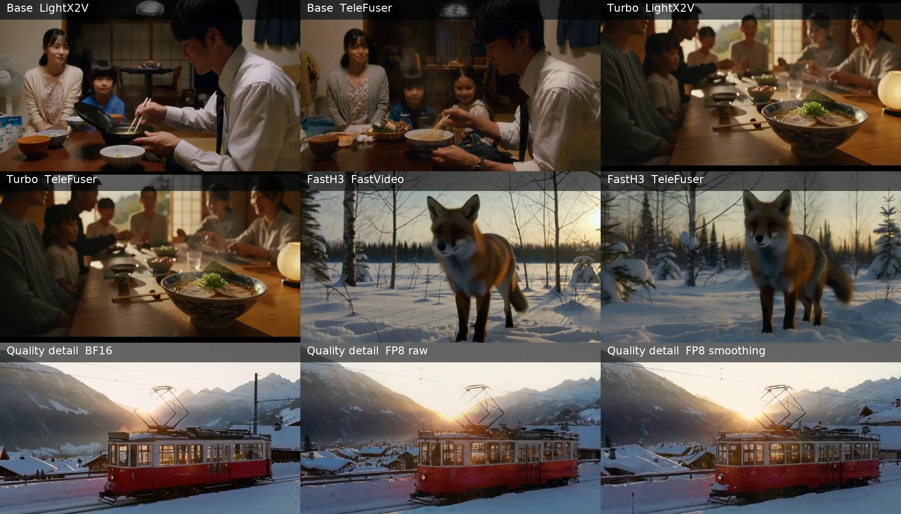

<!-- GENERATED by scripts/build_blog.py; edit sections/* sources. -->

<!--
SECTION-CONTRACT
id: 00-introduction
incoming_premise: none
outgoing_question: Why do low precision and sparse attention need one design?
evidence: experiments/h100-4gpu-e2e/raw/summary.json
do_not_claim: Do not generalize performance beyond the evaluated MiniMax-H3 configurations.
-->

# Q-SPA: Quantized Sparse-Parallel Attention for World Models with TeleFuser

Heyang Sun · <a href="mailto:hsunbi@connect.ust.hk">hsunbi@connect.ust.hk</a>

[TeleFuser](https://github.com/Tele-AI/TeleFuser) is an open-source streaming
inference and serving framework for real-time world models and multimodal
generation. It brings model execution, distributed GPU inference, stateful
serving, and streaming delivery into one runtime. This post introduces Q-SPA:
a quantized, sparse, and parallel attention path for compute-intensive
diffusion transformers.

  <strong>4 × H100: a 5-second, 1344 × 768, 124-frame video with synchronized stereo audio in 52.27 seconds</strong>
  At the same four-GPU topology, TeleFuser is 2.64x faster than LightX2V and 1.52x faster than SGLang.

MiniMax-H3 is the primary evaluation model. Its DiT jointly generates
high-resolution video and synchronized audio, with substantial work in both
large Linear/MLP layers and long-sequence attention. We therefore evaluate
motion, visual detail, and audio integrity together with performance.

TeleFuser now brings three execution dimensions together:

- FP8 Linear and layout-aware FP8 attention;
- Sol-Attn sparsity with selective dense computation;
- Ulysses sequence parallelism, tensor parallelism, and communication overlap.

## Insights

- Quantization and sparsity are complementary. When a sparse attention kernel
  consumes FP8 directly, both optimizations contribute to the speedup.
- General-purpose quantization is often unstable on world-model DiTs. Their
  attention layouts, activation ranges, and hardware-specific kernels require
  targeted reconstruction rather than a drop-in quantizer.
- A world-model request combines conditioning and reasoning with long-sequence
  video/audio denoising and decoding. Even when the weights fit on one GPU,
  the full generation path remains compute-intensive; sequence parallelism,
  tensor parallelism, and communication overlap turn additional GPUs into
  lower end-to-end latency.

TeleFuser scales the same Base H3 request across one, two, and four GPUs; the
four-GPU run reaches **3.40x** the single-GPU denoise throughput. The evaluation
also covers SGLang, LightX2V, FastVideo, Turbo LoRA, and FastH3.

The rest of this post follows four questions:

1. Why do quantization and block-sparse attention conflict in existing kernels?
2. How does Q-SPA make their layouts compatible?
3. How does attention smoothing recover quality without giving back the speed?
4. How does the same attention path scale across GPUs?

---

<!--
SECTION-CONTRACT
id: 01-why-co-design
incoming_premise: TeleFuser needs to accelerate a high-quality multimodal DiT without treating each feature independently.
outgoing_question: What does TeleFuser add at the model, attention, and distributed levels?
evidence: MiniMax-H3 execution profile and hardware-specific kernel support
do_not_claim: General FP8 support implies an FP8 sparse-attention path.
-->

# Why FP8 and Sparse Attention Need One Design

**FP8 and sparse attention address different compute bottlenecks.** FP8 reduces
the compute and bandwidth cost of Linear/MLP layers, while Sol-Attn skips
unimportant blocks in long-sequence attention. Accelerating the full DiT
requires both in one execution path.

**The core conflict is a fixed quantized layout meeting per-forward dynamic
reordering.** Offline, online, or lazy quantization creates low-precision values
and scales per tensor, row, channel, group, or block, after which the kernel
assumes a stable layout. Sol-Attn, Top-K, and Top-P select, evict, and compact
blocks from the current Q/K/V, changing group boundaries and tile indices so
quantized values, scales, and sparse indices no longer retain their original
mapping.

**Existing quantization and sparsity implementations cannot be composed as two
independent switches.** Per-row, per-channel, and per-group scales directly lose
their mapping; a per-tensor scale remains numerically valid, but the kernel's
packing and addressing contract still breaks. Dequantizing selected blocks to
BF16 restores compatibility at the cost of the low-precision speedup.

**Low-precision kernels must also match the deployed GPU.** MXFP8 and NVFP4
implementations for newer hardware do not automatically cover existing
platforms such as SM90, so TeleFuser supplies hardware-matched low-precision
paths for those GPUs.

**Q-SPA gives reordered data, scales, sparse indices, and kernel tiles one
mapping.** Dominant Linear work and selected attention blocks stay on the
hardware-matched FP8 path, while sensitive normalization and positional
transforms remain in higher precision.

---

<!--
SECTION-CONTRACT
id: 02-system-overview
incoming_premise: FP8 and sparsity need one hardware-aware model contract.
outgoing_question: How does TeleFuser keep the combined approximation stable?
evidence: TeleFuser PRs 16, 25, 30, 35, and 44
do_not_claim: TeleFuser invented Sol-Attn or makes all H3 operators FP8.
-->

# Q-SPA in TeleFuser {#q-spa-system}

The MiniMax-H3 work extends TeleFuser at three levels: dense DiT compute,
long-sequence attention, and model-scale execution. Users select one supported
inference profile that brings these capabilities together.

## Layout-aware FP8 sparse attention

TeleFuser applies FP8 to the DiT projections and MLPs, then carries the same
precision into Sol-Attn. Sparse block indices, quantization scales, and the
tiles consumed by the attention kernel are kept in the same layout contract.
Selected QKV blocks can therefore remain in FP8 instead of returning to a BF16
attention backend.

## Model variants

MiniMax-H3 is used both as a base model and with acceleration or style adapters.
TeleFuser supports the official Turbo LoRA path as well as FastH3-style LoRA
and dense adapters. Adapter changes are incorporated into the effective model
before its reusable FP8 representation is created, ensuring that low-precision
execution represents the requested model rather than the base checkpoint.

Distilled adapters such as Turbo LoRA can reduce denoising steps, while other
adapters target output quality for a specific task. Q-SPA incorporates the
adapter's effective weights into the FP8, sparse, and parallel path, reducing
end-to-end inference cost for the requested model rather than optimizing only
the Base checkpoint.

## Distributed execution for long sequences

TeleFuser does more than enable Ulysses SP for MiniMax-H3. It adapts the
multi-GPU path to FP8, Sol-Attn, and the model's video-token layout. FP8
quantization and Sol routing run on the rank-local attention view established
by Ulysses All-to-All, keeping quantization scales and sparse blocks aligned
with the actual compute layout. Three-dimensional video tokens are reordered
before sequence partitioning; a scalar diffusion timestep remains replicated,
while per-token timesteps follow the token shards. These rules preserve the
model semantics across single- and multi-GPU execution.

TeleFuser also adds sequence-parallel kernels and overlaps Ulysses communication
with attention compute. The resulting two- and four-GPU MiniMax-H3 path,
including `TP2 × Ulysses SP2`, carries FP8 and sparse-attention gains into
end-to-end distributed inference.

---

<!--
SECTION-CONTRACT
id: 03-quality-and-scale
incoming_premise: The shared FP8 sparse path is faster but perturbs a recurrent denoising trajectory.
outgoing_question: What performance and quality does the complete path deliver?
evidence: PR40 quality suite, PR37 overlap work, and distributed benchmark
do_not_claim: One prompt or one full-reference metric proves perceptual equivalence.
-->

# Quality Controls and Multi-GPU Scaling

Diffusion models feed each prediction into the next denoising update, so FP8
and sparse attention must preserve a stable trajectory as well as reduce
compute. TeleFuser addresses this inside its FP8 path and in the policy that
selects sparse work.

## Quality-aware FP8 attention

Profiling real MiniMax-H3 layers revealed that K and V can have clear non-zero
mean distributions. That offset reduces the useful range of symmetric FP8.
TeleFuser handles it as an attention-specific form of asymmetric quantization:
K and V are centralized before FP8 compute, and the equivalent shift is
compensated in the attention output.

The centralization and correction were fused into the existing FP8 Sol-Attn
path so quality does not require a separate performance mode. The initial
unfused implementation added 11.7% denoising overhead; fusion reduced the final
cost to 2.2%. On a captured MiniMax-H3 layer, K quantization MSE fell by 21.65%
and attention-output MSE by 8.18%. KV smoothing and V correction are enabled by
default in the optimized profile.

| Model | Resolution and frames | Sampling | GPUs | Case / seed |
|---|---|---|---:|---|
| MiniMax-H3 Base, T2VA | 1344 × 768, 107 frames, 4 s at 24 FPS | 50 points / 49 DiT updates | 1 × H100 | snow tram / 17 |

Smoothed FP8 raises denoise throughput by 37.2% over BF16 Linear +
FlashAttention 4 and reduces peak allocated memory by 42.6%. The fused
correction adds 2.1% denoise time over raw FP8.

| Configuration (BF16 reference) | Video PSNR ↑ | Video SSIM ↑ | Audio cosine ↑ | Spectral convergence error ↓ |
|---|---:|---:|---:|---:|
| FP8, unsmoothed | **19.63 dB** | **0.6712** | 0.8504 | 0.5055 |
| FP8, smoothing enabled | 19.27 dB | 0.6700 | **0.8891** | **0.4537** |

**Prompt:** `Locked-off cinematic wide shot of a red vintage tram gliding slowly through a snowy alpine village at sunrise. The tram remains rigid and geometrically consistent, its windows and wheels stay aligned. Light snow falls; soft rail sounds and distant church bells are synchronized with the scene. No people, no cuts, no camera movement.`

  <figure>
    <figcaption>BF16 reference</figcaption>
    <video controls playsinline preload="metadata" data-result-slot="bf16-quality"></video>
  </figure>
  <figure>
    <figcaption>FP8, unsmoothed</figcaption>
    <video controls playsinline preload="metadata" data-result-slot="fp8-unsmoothed"></video>
  </figure>
  <figure>
    <figcaption>FP8, smoothing enabled</figcaption>
    <video controls playsinline preload="metadata" data-result-slot="fp8-smoothed"></video>
  </figure>

In the latter part of the clip, the unsmoothed output shows less stable roof
markings, overhead linkage, and window alignment than the smoothed output.

## Sparsity designed for continued optimization

**TeleFuser also optimizes Sol-Attn execution itself.** QK and PV GEMMs run in
FP8, dequantization is fused into attention execution to avoid a separate data
conversion and memory round trip, and Two-way KV splitting schedules K/V work
in two parallel partitions to improve SM utilization on sparse shapes.

**Combining FP8 with Sol-Attn also requires explicit handling of sparse-route
boundaries.** When a route length does not meet the FP8 kernel's tile alignment,
TeleFuser applies Tail padding and restores the true route length after compute.
Padding therefore cannot enter the valid output, preserving correctness across
quantization and dynamic sparsity.

**The sparsity policy remains configurable for continued optimization.**
TeleFuser exposes the dense window, dense layers, threshold mode, and sparsity
strength. Its MiniMax-H3 defaults are already tuned for performance and output
quality and can be used directly.

## The same path on multiple GPUs

TeleFuser specializes its SP kernels for FP8, Sol-Attn, and world-model video
generation. Each GPU quantizes FP8 QKV and runs Sol-Attn on its local attention
layout after Ulysses All-to-All. Three-dimensional video-token reordering runs
before sequence partitioning; scalar timesteps remain replicated, while
per-token timesteps are sharded with the video tokens. Ulysses communication is
also overlapped with attention compute to reduce multi-GPU overhead.

---

<!--
SECTION-CONTRACT
id: 04-evaluation
incoming_premise: TeleFuser combines precision, sparsity, smoothing, adapters, and distributed execution.
outgoing_question: What does this add to TeleFuser as a world-model runtime?
evidence: normalized records under experiments/h100-4gpu-e2e/raw and experiments/adapter-suite/raw
do_not_claim: Do not combine incomparable schedules or present invalid media as measurements.
-->

# Performance and Output Quality {#results}

## Evaluation matrix

Unless noted otherwise, each run uses MiniMax-H3's 768p profile and writes 24 FPS H.264 video with 32 kHz stereo AAC audio.

| Experiment | Model and task | Output | Sampling | GPUs | Topology |
|---|---|---|---|---:|---|
| TeleFuser scaling | Base H3, T2VA | 1344 × 768, 124 frames, 5 s | 50 points / 49 DiT updates | 1 / 2 / 4 | local / TP2 / TP2 × Ulysses SP2 |
| Four-GPU frameworks | Base H3, T2VA | 1344 × 768, 124 frames, 5 s | 50 points / 49 DiT updates | 4 | TP2 × Ulysses SP2; FastVideo SP4 |
| FP8 smoothing | Base H3, T2VA | 1344 × 768, 107 frames, 4 s | 50 points / 49 DiT updates | 1 | local |
| Turbo LoRA | MiniMax-H3 Turbo, I2AV | 1344 × 768, 124 frames, 5 s | 9 points / 8 DiT updates | 1 | local |
| FastH3 adapter | FastH3 dense, T2VA | 1344 × 768, 124 frames, 5 s | 5 points / 4 DiT updates | 1 | local |

## TeleFuser scaling

All three runs use the same prompt, seed, FP8 Linear, and FP8 Sol-Attn. The single-GPU run is local, the two-GPU run uses TP2, and the four-GPU run adds Ulysses SP2 over TP2.

  
<strong>3.40x higher</strong>four-GPU denoise throughput

  
<strong>70.6% lower</strong>denoise time: 167.41 → 49.28 seconds

  
<strong>35.5% lower</strong>maximum sampled peak per GPU

Denoising falls from 167.41 seconds on one GPU to 90.90 seconds on two and 49.28 seconds on four. The adjacent scaling steps deliver 1.84x and 1.84x speedups; 50-step throughput is 0.299, 0.550, and 1.015 step/s.

## Four-GPU Base H3 framework comparison

All four frameworks use the same Base H3 output shape and 50-point schedule with feature cache disabled. SGLang, LightX2V, and TeleFuser use `TP2 × Ulysses SP2`; FastVideo uses `SP4`. FastVideo and SGLang respectively use their official [Base H3 example](https://github.com/hao-ai-lab/FastVideo/blob/main/examples/inference/basic/basic_minimax_h3_t2v.py) and [MiniMax-H3 cookbook](https://github.com/sgl-project/sglang/blob/main/docs/cookbook/diffusion/MiniMax/MiniMax-H3.mdx).

  
<strong>2.64x faster</strong>generation than LightX2V

  
<strong>2.19x faster</strong>request than FastVideo

  
<strong>40.3% / 37.3% lower</strong>peak memory vs. LightX2V / SGLang

TeleFuser completes generation in 52.27 seconds, compared with 137.76 seconds for LightX2V, 114.70 seconds for FastVideo, and 79.37 seconds for SGLang. It is 2.64× faster than LightX2V, 2.19× faster than FastVideo, and 1.52× faster than SGLang on this request. Peak memory is 42.5 GiB/GPU for TeleFuser, versus 71.2 GiB for LightX2V, 41.9 GiB for FastVideo, and 67.8 GiB for SGLang. Against LightX2V, denoising falls from 129.22 to 49.28 seconds and 50-point throughput rises by 162.2%.

**Prompt:** `Steam rises from the ramen while the family talks in the background.`

  <figure>
    <figcaption>LightX2V</figcaption>
    <video controls playsinline preload="metadata" data-result-slot="lightx2v-base-h3"></video>
  </figure>
  <figure>
    <figcaption>FastVideo</figcaption>
    <video controls playsinline preload="metadata" data-result-slot="fastvideo-base-h3"></video>
  </figure>
  <figure>
    <figcaption>SGLang</figcaption>
    <video controls playsinline preload="metadata" data-result-slot="sglang-base-h3"></video>
  </figure>
  <figure>
    <figcaption>TeleFuser</figcaption>
    <video controls playsinline preload="metadata" data-result-slot="telefuser-base-h3"></video>
  </figure>

## Adapter workloads

Turbo LoRA and FastH3 use different weights and sampling contracts. Current framework support is:

| Framework | MiniMax-H3 Turbo LoRA | FastH3 Preview adapter |
|---|---|---|
| TeleFuser | ✅ Supported | ✅ Supported |
| LightX2V | ✅ Supported | ❌ Unsupported |
| FastVideo | ❌ Unsupported | ✅ Supported |
| SGLang | ✅ Supported | ❌ Unsupported |

The Turbo LoRA comparison covers TeleFuser and LightX2V; the FastH3 comparison covers TeleFuser and FastVideo.

### MiniMax-H3 Turbo LoRA

Both frameworks use the 8-step v1.0 768p adapter with resident DiT weights. TeleFuser merges the LoRA before creating FP8 weights. CPU block offload is excluded.

  
<strong>26.7% lower</strong>denoise time than LightX2V

  
<strong>36.5% higher</strong>8-step denoise throughput

  
<strong>12.3% lower</strong>whole-process peak GPU memory

**Prompt:** `Steam rises from the ramen while the family talks in the background.`

  <figure>
    <figcaption>LightX2V: MiniMax-H3 Turbo</figcaption>
    <video controls playsinline preload="metadata" data-result-slot="turbo-lightx2v"></video>
  </figure>
  <figure>
    <figcaption>TeleFuser: MiniMax-H3 Turbo</figcaption>
    <video controls playsinline preload="metadata" data-result-slot="turbo-telefuser"></video>
  </figure>

### FastH3 dense adapter

  
<strong>25.7% lower</strong>denoise time than FastVideo

  
<strong>34.6% higher</strong>actual DiT-forward throughput

  
<strong>14.3% lower</strong>whole-process peak GPU memory

**Prompt:** `integrated_multimodal_description: A red fox runs through fresh snow at dawn. overall_soundscape: Fast pawsteps in snow, winter wind, and distant birds.`

  <figure>
    <figcaption>FastVideo: FastH3</figcaption>
    <video controls playsinline preload="metadata" data-result-slot="fastvideo-primary"></video>
  </figure>
  <figure>
    <figcaption>TeleFuser: FastH3</figcaption>
    <video controls playsinline preload="metadata" data-result-slot="telefuser-primary"></video>
  </figure>

---

<!--
SECTION-CONTRACT
id: 05-lessons
incoming_premise: TeleFuser's combined path improves performance while retaining measurable output quality.
outgoing_question: none
evidence: final benchmark and quality records
do_not_claim: Performance portability beyond the tested MiniMax-H3 configurations.
-->

# Q-SPA in TeleFuser

Q-SPA addresses three connected problems in TeleFuser:

- aligning FP8 scale groups with dynamically selected attention blocks;
- controlling error when FP8 and sparsity affect the same denoising trajectory;
- running sparse FP8 attention with Ulysses SP, tensor parallelism, and
  communication overlap.

TeleFuser can run Base H3 or merge a Turbo LoRA or FastH3 adapter before
creating the FP8 weights. Adapters can reduce denoising steps or improve output
quality for a target task. Q-SPA incorporates the effective weights into the
low-precision, sparse, and parallel path, reducing end-to-end inference cost
for the actual adapter model.

On the matched four-GPU Base H3 workload, TeleFuser completes generation in
52.27 seconds. It is 2.64× faster than LightX2V, 2.19× faster than FastVideo,
and 1.52× faster than SGLang. The Turbo LoRA and FastH3 runs also outperform
their LightX2V and FastVideo baselines.

These implementations and experiments lead to three practical insights for world-model inference:

- FP8 and sparse attention should be designed as one path. Applying either in
  isolation leaves substantial DiT work on the table; matching the quantized
  representation to the sparse kernel allows both optimizations to contribute.
- World-model quality is not guaranteed by a generic quantization wrapper.
  The long-sequence attention layout and activation statistics make a
  hardware-specific, quality-aware implementation necessary.
- A world-model request combines conditioning and reasoning, long-sequence
  video/audio denoising, and decoding; whether its weights fit on one GPU does
  not capture that compute pressure. Ulysses SP, tensor parallelism, and
  communication overlap shorten the full generation path. MiniMax-H3 denoising
  falls from 167.41 seconds on one GPU to 90.90 seconds on two and 49.28 seconds
  on four, reaching 3.40x the single-GPU throughput.

## Further reading

- [TeleFuser](https://github.com/Tele-AI/TeleFuser)
- [MiniMax-H3 model and official pipeline](https://huggingface.co/MiniMaxAI/MiniMax-H3)
- [Sol-Attn: on-the-fly attention sparsification](https://nvlabs.github.io/Sana/Sol-Attn/)
- [FastVideo MiniMax-H3 cookbook](https://haoailab.com/FastVideo/cookbook/minimax-h3/)
- [LightX2V MiniMax-H3 examples](https://github.com/ModelTC/LightX2V/tree/main/scripts/minimax_h3)
- [SGLang MiniMax-H3 cookbook](https://github.com/sgl-project/sglang/blob/main/docs/cookbook/diffusion/MiniMax/MiniMax-H3.mdx)
- [TorchAO quantized inference workflows](https://docs.pytorch.org/ao/stable/workflows/inference.html)
