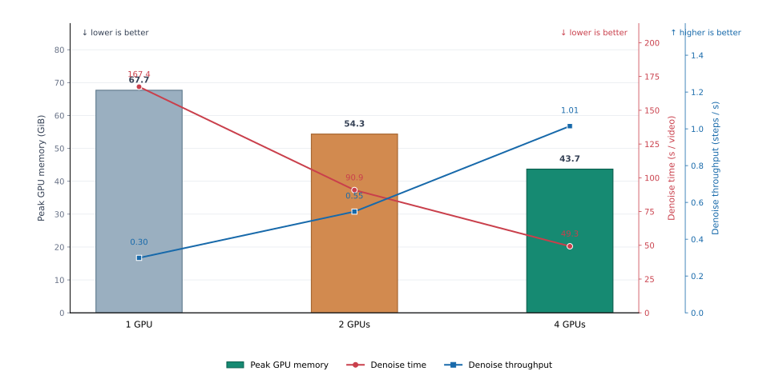
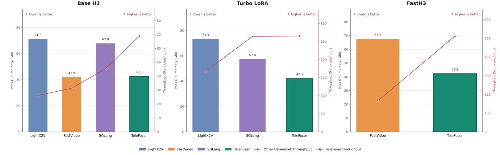
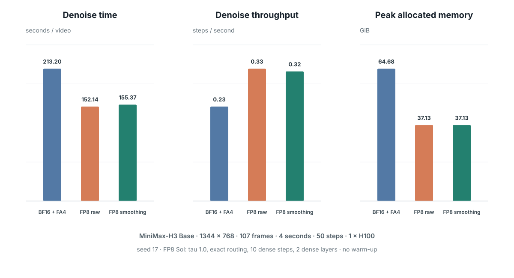

<!-- GENERATED by scripts/build_blog.py; edit sections/* sources. -->

<!--
LOCALIZED-SOURCE
id: 00-introduction
language: zh-CN
-->

# Q-SPA：用 TeleFuser 实现量化、稀疏与并行协同的世界模型推理

作者：Heyang Sun · <a href="mailto:hsunbi@connect.ust.hk">hsunbi@connect.ust.hk</a>

[TeleFuser](https://github.com/Tele-AI/TeleFuser) 是一个面向实时世界模型和多模态生成的开源推理与服务框架，支持分布式推理、有状态服务和流式传输。本文介绍 Q-SPA（Quantized Sparse-Parallel Attention）：一套协同设计 FP8 量化、动态稀疏 attention 与序列并行的执行方案。

  <strong>4 × H100：52.27 秒生成 5 秒、1344 × 768、124 帧视频和同步立体声音频</strong>
  相同四卡拓扑下，完整请求比 LightX2V 快 2.64 倍，比 SGLang 快 1.52 倍。

本文以 MiniMax-H3 为主要测试模型。它的 DiT 联合生成高分辨率视频和音频，计算同时集中在大规模 Linear/MLP 和长序列 attention。性能优化必须和运动稳定性、画面细节及音频完整性一起验证。

Q-SPA 包含三个相互关联的执行维度：

- 面向 Linear 与 attention 的 FP8 低精度计算；
- 基于 Sol-Attn 的动态 block 稀疏，以及质量敏感区域的稠密计算；
- Ulysses SP、Tensor Parallel 与通信计算重叠。

## Insights

- 量化与稀疏可以同时使用。稀疏 attention kernel 直接消费 FP8 表示时，两项
  优化能够共同贡献加速收益。
- 通用量化方案在 world model 的 DiT 上容易出现质量波动。attention 布局、
  激活范围和硬件相关 kernel 需要有针对性的重构，而不是套用通用量化封装。
- World-model 请求不仅包含长序列 DiT 去噪，还要完成条件理解与推理、视频和音频联合生成及解码。模型即使能够放入单卡，整条生成链路仍面临很高的计算压力；序列并行、张量并行与通信计算重叠可以把多卡算力转化为端到端延迟收益。

TeleFuser 的 Base H3 请求从 1 卡扩展到 2 卡和 4 卡，四卡去噪吞吐达到单卡的 **3.40 倍**。评测还包括 SGLang、LightX2V、FastVideo 以及 Turbo LoRA 和 FastH3 Adapter。

---

<!--
LOCALIZED-SOURCE
id: 01-why-co-design
language: zh-CN
-->

# 量化与稀疏 attention 的布局冲突

**FP8 与稀疏 attention 解决不同的计算瓶颈。** FP8 降低 Linear/MLP 的计算与带宽开销，Sol-Attn 跳过长序列中不重要的 attention block；要进一步加速 DiT，需要让两者在同一执行路径中工作。

**核心冲突是固定的量化布局遇上每次 forward 的动态重排。** Offline、online 或 lazy 量化按 tensor、row、channel、group 或 block 生成低精度数据和 scale，kernel 随后假设布局不变。Sol-Attn、Top-K 和 Top-P 则会根据当前 Q/K/V 选择、淘汰并压紧 block，改变分组边界和 tile 编号，使量化数据、scale 与稀疏索引失去原有对应关系。

**现有量化与稀疏实现无法作为两个独立开关直接叠加。** Per-row、per-channel 和 per-group scale 会直接失配；per-tensor scale 虽然数值仍有效，既有 kernel 的打包和寻址约定也已被破坏。将选中的 block 反量化为 BF16 可以恢复兼容，但会抵消低精度计算的收益。

**低精度 kernel 还必须适配实际部署的 GPU。** 面向新硬件的 MXFP8、NVFP4 实现不会自动覆盖 SM90 等现有平台，TeleFuser 因此为这些 GPU 补齐硬件匹配的低精度执行路径。

**Q-SPA 统一重排后的数据、scale、稀疏索引和 kernel tile。** 主要 Linear 与选中的 attention block 继续使用硬件匹配的 FP8 kernel，归一化和位置编码等敏感计算保留高精度。

---

<!--
LOCALIZED-SOURCE
id: 02-system-overview
language: zh-CN
-->

# Q-SPA 在 TeleFuser 中的实现 {#q-spa-system}

在 MiniMax-H3 上，Q-SPA 覆盖三层执行逻辑：DiT 稠密计算、长序列 attention 和多卡 tensor 布局。

## 让 FP8 和稀疏 block 使用同一份布局

TeleFuser 将 FP8 应用于 DiT 的投影层和 MLP，并将低精度执行延伸到 Sol-Attn。稀疏 block 索引、量化 scale 和 attention kernel 使用的 tile 遵循统一的布局约定，使选中的 QKV block 能够直接参与 FP8 计算，无需预先转换为 BF16。

**TeleFuser 同时优化了 Sol-Attn 本身的执行效率。** QK 和 PV GEMM 使用 FP8 计算，dequant 被融合进 attention 执行；Two-way KV splitting 将 K/V 计算分成两路并行调度，提高稀疏 shape 下的 SM 利用率。FP8 与 Sol-Attn 共同使用时，TeleFuser 还会通过 Tail padding 满足 kernel 的 tile 对齐要求，并在计算后恢复真实 route length，确保 padding 不会进入有效输出。dense window、dense layer、阈值模式和稀疏强度均保留调优接口，MiniMax-H3 的默认配置已经完成性能与生成质量调优，可直接使用。

## 分布式 attention

TeleFuser 不只是把 Ulysses SP 接入 MiniMax-H3，还针对 FP8、Sol-Attn 和视频 token 布局重构了多卡执行路径。Ulysses All-to-All 建立各 rank 的局部 attention 视图后，再完成 FP8 quantization 和 Sol-Attn routing，使量化 scale、稀疏 block 与实际计算布局保持一致。3D 视频 token 的 reorder 被移到序列切分之前；全局共享的 scalar timestep 在各 rank 复制，per-token timestep 则随 token 一起切分，从而保持模型语义和单卡结果一致。

在此基础上，TeleFuser 为 sequence parallel 补充了专用 kernel，并将 Ulysses 通信与 attention 计算重叠。该路径支持双卡和四卡 MiniMax-H3，包括 `TP2 × Ulysses SP2`，使 FP8 与稀疏带来的算术加速能够继续转化为多卡端到端收益。

## 支持蒸馏与高质量 adapter

MiniMax-H3 除了 Base 模型，还有 Turbo LoRA 和 FastH3 一类加速 Adapter。TeleFuser 会先把 Adapter 合并到有效权重，再建立可复用的 FP8 表示，避免量化的仍是原始 Base 权重。

Turbo LoRA 等蒸馏 Adapter 可以减少去噪步数，其他 Adapter 则用于提高特定任务的输出质量。Q-SPA 会把 Adapter 合并后的有效权重纳入 FP8、稀疏和并行执行路径，从而降低这些模型的端到端推理成本，而不只优化 Base checkpoint。

---

<!--
LOCALIZED-SOURCE
id: 03-quality-and-scale
language: zh-CN
-->

# 面向生成质量的 FP8

Diffusion 的每一步输出都会成为下一步输入，局部 FP8 误差可能沿去噪过程累积。因此，TeleFuser 将 attention smoothing 直接纳入 FP8 执行路径，而不是作为独立的后处理步骤。

MiniMax-H3 的层级 profile 显示，部分 K/V tensor 的均值明显偏离零点。TeleFuser 在 FP8 attention 前中心化 K/V，并在输出中恢复等价偏移。这种针对 attention 分布设计的非对称量化处理，可以更充分地利用 FP8 动态范围，同时保持模型接口不变。

中心化与输出修正已经融合进 FP8 Sol-Attn，并在优化配置中默认开启。相关端到端质量与性能数据放在主体性能评测之后。

---

<!--
LOCALIZED-SOURCE
id: 04-evaluation
language: zh-CN
-->

# 性能与生成效果 {#results}

## 测试配置

| 实验 | 模型与任务 | 输出规格 | 采样 | GPU | 并行拓扑 |
|---|---|---|---|---:|---|
| TeleFuser 扩展性 | Base H3，T2VA | 1344 × 768，124 帧，5 秒，24 fps | 50 次去噪步 | 1 / 2 / 4 | 单卡 / TP2 / TP2 × Ulysses SP2 |
| 框架对比 | Base H3，T2VA | 1344 × 768，124 帧，5 秒，24 fps | 50 次去噪步 | 4 | 各框架原生分布式路径 |
| Turbo LoRA | MiniMax-H3 Turbo，T2VA | 1344 × 768，124 帧，5 秒，24 fps | 8 次去噪步 | 4 | TP2 × Ulysses SP2 |
| FastH3 Adapter | FastH3 dense，T2VA | 1344 × 768，124 帧，5 秒，24 fps | 4 次去噪步 | 4 | 各框架原生分布式路径 |
| FP8 smoothing | Base H3，T2VA | 1344 × 768，107 帧，4 秒，24 fps | 50 次去噪步 | 1 | 单卡 |

## TeleFuser 扩展性

Base H3 从单卡扩展到四卡后，去噪吞吐达到单卡的 **3.40 倍**。该路径将 Tensor Parallel、Ulysses Sequence Parallel 与通信计算重叠结合起来。

## 四卡统一性能对比

柱形表示峰值 GPU 显存，折线表示去噪吞吐。所有数据均使用四张 H100，且未启用 CPU offload。

Base H3 使用 [FastVideo 官方示例](https://github.com/hao-ai-lab/FastVideo/blob/main/examples/inference/basic/basic_minimax_h3_t2v.py)与 [SGLang 官方 cookbook](https://github.com/sgl-project/sglang/blob/main/docs/cookbook/diffusion/MiniMax/MiniMax-H3.mdx)，并采用 LightX2V 和 TeleFuser 的对应示例。Turbo LoRA 对比 TeleFuser、SGLang 与 LightX2V，FastH3 对比 TeleFuser 与 FastVideo。

- **Base H3：** TeleFuser 的端到端吞吐相比 LightX2V、FastVideo 和 SGLang 分别提高 163.5%、119.4% 和 51.8%。峰值显存相比 LightX2V 和 SGLang 分别降低 40.3% 和 37.3%，与 FastVideo 的差异为 1.5%。
- **Turbo LoRA：** TeleFuser 的端到端吞吐相比 LightX2V 提高 58.8%，相比 SGLang 提高 0.3%；峰值显存相比 LightX2V 降低 42.3%，相比 SGLang 降低 26.3%。
- **FastH3：** TeleFuser 的端到端吞吐相比 FastVideo 提高 208.5%，峰值显存降低 37.4%。

## 生成效果

| 框架 | Base H3 | MiniMax-H3 Turbo LoRA | FastH3 Preview Adapter |
|---|---|---|---|
| TeleFuser | ✅ 已支持 | ✅ 已支持 | ✅ 已支持 |
| LightX2V | ✅ 已支持 | ✅ 已支持 | ❌ 未支持 |
| FastVideo | ✅ 已支持 | ❌ 未支持 | ✅ 已支持 |
| SGLang | ✅ 已支持 | ✅ 已支持 | ❌ 未支持 |

**Base H3 与 Turbo LoRA Prompt：** `Steam rises from the ramen while the family talks in the background.`

**FastH3 Prompt：** `Steam rises from the ramen while the family talks in the background.`

  

  
Base H3

  
Turbo LoRA

  
FastH3

  
LightX2V

  <figure><video controls playsinline preload="metadata" data-result-slot="lightx2v-base-h3"></video></figure>
  <figure><video controls playsinline preload="metadata" data-result-slot="turbo-lightx2v"></video></figure>
  
暂不支持

  
FastVideo

  <figure><video controls playsinline preload="metadata" data-result-slot="fastvideo-base-h3"></video></figure>
  
暂不支持

  <figure><video controls playsinline preload="metadata" data-result-slot="fastvideo-primary"></video></figure>

  
SGLang

  <figure><video controls playsinline preload="metadata" data-result-slot="sglang-base-h3"></video></figure>
  <figure><video controls playsinline preload="metadata" data-result-slot="turbo-sglang"></video></figure>
  
暂不支持

  
TeleFuser

  <figure><video controls playsinline preload="metadata" data-result-slot="telefuser-base-h3"></video></figure>
  <figure><video controls playsinline preload="metadata" data-result-slot="turbo-telefuser"></video></figure>
  <figure><video controls playsinline preload="metadata" data-result-slot="telefuser-primary"></video></figure>

## FP8 attention smoothing

最早的非融合实现使去噪时间增加 11.7%，融合后开销降至 2.2%。在捕获的 MiniMax-H3 真实层上，K 的量化 MSE 降低 21.65%，attention 输出 MSE 降低 8.18%。

| 配置（BF16 为 reference） | 视频 PSNR ↑ | 视频 SSIM ↑ | 音频 cosine ↑ | 频谱收敛误差 ↓ |
|---|---:|---:|---:|---:|
| FP8，不使用 smoothing | **19.63 dB** | **0.6712** | 0.8504 | 0.5055 |
| FP8，开启 smoothing | 19.27 dB | 0.6700 | **0.8891** | **0.4537** |

**Prompt:** `Locked-off cinematic wide shot of a red vintage tram gliding slowly through a snowy alpine village at sunrise. The tram remains rigid and geometrically consistent, its windows and wheels stay aligned. Light snow falls; soft rail sounds and distant church bells are synchronized with the scene. No people, no cuts, no camera movement.`

  <figure><figcaption>BF16 reference</figcaption><video controls playsinline preload="metadata" data-result-slot="bf16-quality"></video></figure>
  <figure><figcaption>FP8，不使用 smoothing</figcaption><video controls playsinline preload="metadata" data-result-slot="fp8-unsmoothed"></video></figure>
  <figure><figcaption>FP8，开启 smoothing</figcaption><video controls playsinline preload="metadata" data-result-slot="fp8-smoothed"></video></figure>

在视频后半段，smoothing 提高了车顶标识、受电弓连线和窗框对齐的时序稳定性；音频 cosine 从 0.850 提升至 0.889，频谱收敛误差从 0.506 降至 0.454。

---

<!--
LOCALIZED-SOURCE
id: 05-lessons
language: zh-CN
-->

# 结语

Q-SPA 在 TeleFuser 中解决了三个直接相关的问题：

- FP8 scale 与动态稀疏 block 的布局对齐；
- FP8 和稀疏共同作用时的生成误差控制；
- 稀疏 FP8 attention 在 Ulysses SP 与 Tensor Parallel 下的多卡执行。

TeleFuser 支持直接运行 Base H3，也支持在合并 Turbo LoRA 或 FastH3 Adapter 后生成相应的 FP8 权重。Adapter 可以减少去噪步数或提高特定任务的输出质量；Q-SPA 将合并后的有效权重纳入低精度、稀疏和并行优化路径，降低实际 Adapter 模型的端到端推理成本。

四卡 Base H3 测试中，TeleFuser 完整生成耗时 52.27 秒，相比 LightX2V、FastVideo 和 SGLang 分别快 2.64 倍、2.19 倍和 1.52 倍。Turbo LoRA 相比 LightX2V 快 1.59 倍，与 SGLang 的差异为 0.3%；FastH3 相比 FastVideo 快 3.09 倍。

这些实现与实验带来了三点面向 world-model 推理实践的 Insights：

- FP8 与稀疏 attention 应当作为一条执行路径共同设计。单独使用任一优化
  仍会留下大量 DiT 计算；让稀疏 kernel 直接消费量化表示，才能同时获得两者的收益。
- 通用量化封装不能保证 world model 的生成质量。长序列 attention 的布局和
  激活统计具有模型与硬件相关性，需要重新设计面向质量的量化与 kernel 实现。
- World model 的单次请求同时承担条件理解与推理、长序列视频/音频联合去噪和解码，算力压力不能用权重能否装入单卡来衡量。Ulysses SP、Tensor Parallel 与通信计算重叠共同缩短完整生成链路；MiniMax-H3 的去噪时间从单卡的 167.41 秒降至两卡的 90.90 秒和四卡的 49.28 秒，四卡吞吐达到单卡的 3.40 倍。

## 延伸阅读

- [TeleFuser](https://github.com/Tele-AI/TeleFuser)
- [MiniMax-H3 模型与官方 Pipeline](https://huggingface.co/MiniMaxAI/MiniMax-H3)
- [Sol-Attn：在线注意力稀疏化](https://nvlabs.github.io/Sana/Sol-Attn/)
- [FastVideo MiniMax-H3 Cookbook](https://haoailab.com/FastVideo/cookbook/minimax-h3/)
- [LightX2V MiniMax-H3 示例](https://github.com/ModelTC/LightX2V/tree/main/scripts/minimax_h3)
- [SGLang MiniMax-H3 Cookbook](https://github.com/sgl-project/sglang/blob/main/docs/cookbook/diffusion/MiniMax/MiniMax-H3.mdx)
- [TorchAO 量化推理工作流](https://docs.pytorch.org/ao/stable/workflows/inference.html)
