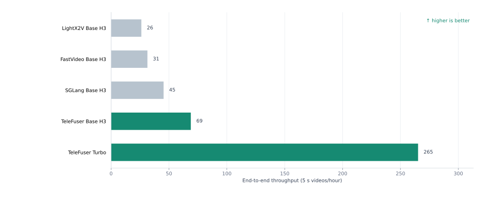

<!--
SECTION-CONTRACT
id: 00-introduction
incoming_premise: none
outgoing_question: Why do low precision and sparse attention need one design?
evidence: experiments/h100-4gpu-e2e/raw/summary.json
do_not_claim: Do not generalize performance beyond the evaluated MiniMax-H3 configurations.
-->

# Q-SPA: Quantized Sparse-Parallel Attention for World Models with TeleFuser

Heyang Sun · <a href="mailto:hsunbi@connect.ust.hk">hsunbi@connect.ust.hk</a>

[TeleFuser](https://github.com/Tele-AI/TeleFuser) is an open-source streaming
inference and serving framework for real-time world models and multimodal
generation. It brings model execution, distributed GPU inference, stateful
serving, and streaming delivery into one runtime. This post introduces Q-SPA:
a quantized, sparse, and parallel attention path for compute-intensive
diffusion transformers.

  <strong>4 × H100: a 5-second, 1344 × 768, 124-frame video with synchronized stereo audio in 52.27 seconds</strong>
  At the same four-GPU topology, TeleFuser is 2.64x faster than LightX2V and 1.52x faster than SGLang.

MiniMax-H3 is the primary evaluation model. Its DiT jointly generates
high-resolution video and synchronized audio, with substantial work in both
large Linear/MLP layers and long-sequence attention. We therefore evaluate
motion, visual detail, and audio integrity together with performance.

TeleFuser now brings three execution dimensions together:

- FP8 Linear and layout-aware FP8 attention;
- Sol-Attn sparsity with selective dense computation;
- Ulysses sequence parallelism, tensor parallelism, and communication overlap.

## Insights

- Quantization and sparsity are complementary. When a sparse attention kernel
  consumes FP8 directly, both optimizations contribute to the speedup.
- General-purpose quantization is often unstable on world-model DiTs. Their
  attention layouts, activation ranges, and hardware-specific kernels require
  targeted reconstruction rather than a drop-in quantizer.
- A world-model request combines conditioning and reasoning with long-sequence
  video/audio denoising and decoding. Even when the weights fit on one GPU,
  the full generation path remains compute-intensive; sequence parallelism,
  tensor parallelism, and communication overlap turn additional GPUs into
  lower end-to-end latency.
