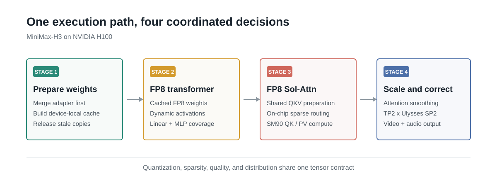

<!--
SECTION-CONTRACT
id: 02-system-overview
incoming_premise: FP8 and sparse attention must share a hardware-aware boundary.
outgoing_question: How do we keep the combined approximation stable and scalable?
evidence: TeleFuser PRs 16, 25, and 30 plus the new operator profile
do_not_claim: TeleFuser invented Sol-Attn.
-->

# The TeleFuser Path

The optimized path has four stages.

**1. Prepare the effective model once.** TeleFuser loads the MiniMax-H3 base
weights on CPU, applies the selected LoRA adapter, and then materializes the
device-local FP8 caches. The ordering matters: a cache built before the adapter
merge represents the wrong model. Once the cache is ready, the superseded
higher-precision copy can be released instead of inflating runtime memory.

**2. Run the dense transformer work in FP8.** The large Linear layers use
cached FP8 weights and dynamically quantized activations. This covers the
projection and feed-forward work that sparse attention cannot reduce.

**3. Preserve the sensitive transforms, then enter FP8 Sol-Attn.** Q/K
normalization and rotary embedding remain at higher precision. Q, K, and V are
then prepared together for attention, so their scales and layouts match the
consumer kernel. The custom SM90 implementation combines on-the-fly Sol routing
with FP8 QK and PV computation; TMA and WGMMA keep the tiled data path native to
H100.

**4. Return a corrected output to the model.** Sparse blocks are not simply
dropped. Sol-Attn carries a compact summary of the skipped contribution, while
TeleFuser restores the attention-centering correction before the next
transformer operation.

This organization removes conversions and layout hand-offs that would
otherwise sit between independent framework features. It also keeps a clear
fallback boundary: unsupported shapes can use a validated attention backend
instead of silently entering an untested kernel path.

The implementation spans several earlier TeleFuser changes, but the public
interface is intentionally small. A MiniMax-H3 pipeline selects an FP8
quantization policy, Sol-Attn, a sparsity threshold, optional smoothing, and a
parallel topology. The complexity stays below that configuration layer.
