<!--
SECTION-CONTRACT
id: 03-system-overview
role: Define the complete optimization stack and component ownership.
sources: TeleFuser PRs 16, 25, 30, 35, 40, and 44.
edit_scope: Architecture only; do not introduce new benchmark claims here.
-->

# 3. System Overview

TeleFuser separates model-level policy from kernel-level mechanism. The model
loader owns weight mutation and quantization order. The model wrapper owns
dense/sparse dispatch and parallel layout. Public ops own portable contracts.
Architecture-specific kernels own layouts, scaling, and fused execution.

```mermaid
flowchart LR
    C[BF16 checkpoint] --> A[Merge supported adapter deltas in FP32]
    A --> W[Materialize cached E4M3 Linear weights]
    X[BF16 hidden states] --> AQ[Dynamic row-wise FP8 activation quantization]
    W --> G[tf-kernel W8A8 Linear GEMM]
    AQ --> G
    G --> QKV[BF16 Q/K/V]
    QKV --> NR[QK norm and RoPE]
    NR --> U{Ulysses enabled?}
    U -->|yes| AA[All-to-all: full sequence, local heads]
    U -->|no| P[Local Q/K/V]
    AA --> P
    P --> S[Exact K/V statistics and centering]
    S --> F[FP8 Q/K/V preparation]
    F --> SOL[SM90 FP8 Sol routing + QK + online softmax + PV]
    SOL --> O[BF16 output correction and dense-prefix merge]
```

## Ownership boundaries

| Layer | Responsibility | Precision boundary |
|---|---|---|
| Model loading | Read BF16 checkpoint, map adapter keys, merge updates | FP32 merge into BF16 source |
| FP8 Linear wrapper | Cache weight scales, quantize activations, call GEMM | E4M3 x E4M3, BF16 output |
| Parallel wrapper | Apply TP/Ulysses collectives and restore layout | BF16 exchange |
| FP8 attention prep | Smooth, scale, quantize, and relayout Q/K/V | Post-RoPE BF16 to E4M3 |
| Sol mainloop | Route blocks, compute exact/summary attention | E4M3 QK/PV, FP32 accumulate |
| Output boundary | Restore V mean and exact dense prefix | BF16 output |

## The six-step optimization ladder

1. **PR #16: general online quantization.** Add backend-neutral configuration
   and module replacement for TorchAO FP8 and BNB NF4.
2. **PR #25: MiniMax-H3 enablement.** Quantize 258 Linear layers while
   preserving FP32-sensitive projections, encoders, and VAEs.
3. **PR #30: native FP8 attention.** Reuse one activation quantization for QKV,
   prepare attention-specific FP8 operands, and execute Sol in an SM90 CuTe
   mainloop.
4. **PR #35: distributed composition.** Place FP8 preparation after Ulysses
   all-to-all and tune KV splitting and route parameters at long sequence
   lengths.
5. **PR #40: quality recovery.** Center K/V with attention-equivalent
   transforms, correct FP8 V bias, and fuse the added boundaries.
6. **PR #44: adapter-aware weights.** Merge standard and hybrid adapters before
   FP8 conversion and reject unsupported VSA replacement gates.

## Dense islands inside an optimized graph

The fastest valid path is deliberately mixed precision. Text encoders and VAEs
stay in their reference precision. MiniMax-H3 keeps the conditioning prefix
exact, recomputes prefix queries with dense BF16 attention, and protects early
steps and layers. Wan restricts FP8 attention to a measured layer interval.
This is not a failure to maximize FP8 coverage; it is the control surface that
keeps quality and performance on the same Pareto frontier.

## Lifecycle matters

The measured peak is not simply "model weight bytes." It can occur during text
encoding, denoising, or decoding, depending on which components are resident.
The system therefore distinguishes:

- steady-state model allocation;
- phase-local `torch.cuda.max_memory_allocated()`;
- whole-process NVML sampled peak; and
- one-time load, quantization, and compilation costs.

Later charts use only comparable definitions within each case.
