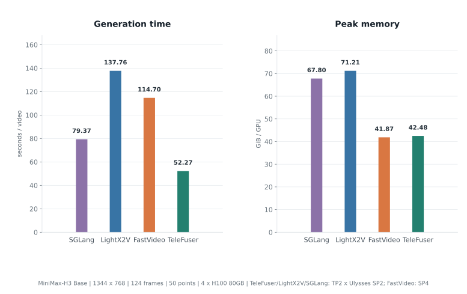
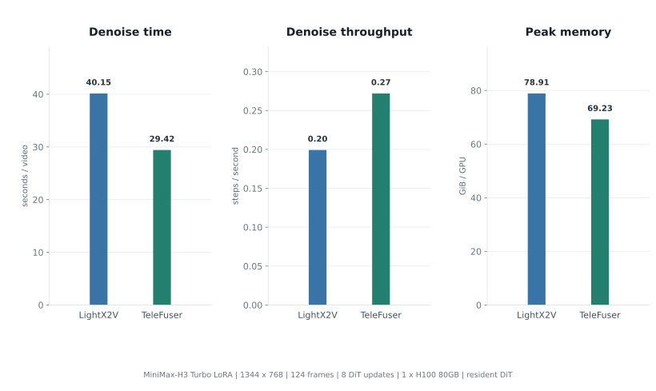
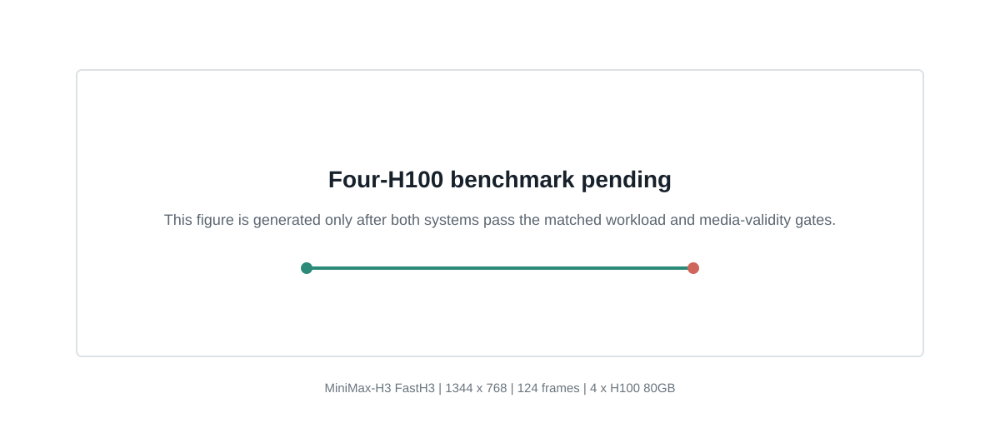

<!--
SECTION-CONTRACT
id: 04-evaluation
incoming_premise: TeleFuser combines precision, sparsity, smoothing, adapters, and distributed execution.
outgoing_question: What does this add to TeleFuser as a world-model runtime?
evidence: normalized records under experiments/h100-4gpu-e2e/raw and experiments/adapter-suite/raw
do_not_claim: Do not combine incomparable schedules or present invalid media as measurements.
-->

# Performance and Output Quality {#results}

## Evaluation matrix

Unless noted otherwise, each run uses MiniMax-H3's 768p profile and writes 24 FPS H.264 video with 32 kHz stereo AAC audio. Performance is measured after warm-up.

| Experiment | Model and task | Output | Sampling | GPUs | Topology |
|---|---|---|---|---:|---|
| TeleFuser scaling | Base H3, T2VA | 1344 × 768, 124 frames, 5 s | 50 points / 49 DiT updates | 1 / 2 / 4 | local / TP2 / TP2 × Ulysses SP2 |
| Four-GPU frameworks | Base H3, T2VA | 1344 × 768, 124 frames, 5 s | 50 points / 49 DiT updates | 4 | TP2 × Ulysses SP2 |
| FP8 smoothing | Base H3, T2VA | 1344 × 768, 107 frames, 4 s | 50 points / 49 DiT updates | 1 | local |
| Turbo LoRA | MiniMax-H3 Turbo, I2AV | 1344 × 768, 124 frames, 5 s | 9 points / 8 DiT updates | 1 | local |
| FastH3 adapter | FastH3 dense, T2VA | 1344 × 768, 124 frames, 5 s | 5 points / 4 DiT updates | 1 | local |

The scaling runs disable feature cache and KV smoothing to isolate parallel execution. The smoothing and adapter sections specify their low-precision profiles separately.

## TeleFuser scaling on one, two, and four GPUs

All three runs use the same prompt, seed, FP8 Linear, and FP8 Sol-Attn. The single-GPU run is local, the two-GPU run uses TP2, and the four-GPU run adds Ulysses SP2 over TP2.

  
<strong>3.40x higher</strong>four-GPU denoise throughput

  
<strong>70.6% lower</strong>denoise time: 167.41 → 49.28 seconds

  
<strong>35.5% lower</strong>maximum sampled peak per GPU

Denoising falls from 167.41 seconds on one GPU to 90.90 seconds on two and 49.28 seconds on four. The adjacent scaling steps deliver 1.84x and 1.84x speedups; 50-step throughput is 0.299, 0.550, and 1.015 step/s.

## Four-GPU Base H3 framework comparison

SGLang, LightX2V, and TeleFuser use four H100 GPUs with `TP2 × Ulysses SP2`. The request uses the same Base H3 output shape and disables feature cache. The [official SGLang MiniMax-H3 cookbook](https://github.com/sgl-project/sglang/blob/main/docs/cookbook/diffusion/MiniMax/MiniMax-H3.mdx) lists this H100 topology; the chart uses the matched local result retained in TeleFuser's MiniMax-H3 documentation.

  
<strong>2.64x faster</strong>generation than LightX2V

  
<strong>1.52x faster</strong>request than SGLang

  
<strong>40.3% / 37.3% lower</strong>peak memory vs. LightX2V / SGLang

TeleFuser completes generation in 52.27 seconds, compared with 137.76 seconds for LightX2V and 79.37 seconds for SGLang. TeleFuser therefore reduces request latency and peak memory by 62.1% and 40.3% versus LightX2V, and by 34.1% and 37.3% versus SGLang. Against LightX2V, denoising falls from 129.22 to 49.28 seconds and 50-step throughput rises by 162.2%.

  <figure>
    <figcaption>LightX2V</figcaption>
    <video controls playsinline preload="metadata" data-result-slot="lightx2v-base-h3"></video>
  </figure>
  <figure>
    <figcaption>TeleFuser</figcaption>
    <video controls playsinline preload="metadata" data-result-slot="telefuser-base-h3"></video>
  </figure>

Both videos use the same prompt and seed, with 124 frames and synchronized stereo audio. Each framework runs one warm-up followed by one measured request. Device memory is sampled through `nvidia-smi` every 100 ms.

## Adapter workloads

### MiniMax-H3 Turbo LoRA

Both frameworks use the 8-step v1.0 768p adapter with resident DiT weights. TeleFuser merges the LoRA before creating FP8 weights. CPU block offload is excluded.

  
<strong>26.7% lower</strong>denoise time than LightX2V

  
<strong>36.5% higher</strong>8-step denoise throughput

  
<strong>12.3% lower</strong>whole-process peak GPU memory

  <figure>
    <figcaption>LightX2V: MiniMax-H3 Turbo</figcaption>
    <video controls playsinline preload="metadata" data-result-slot="turbo-lightx2v"></video>
  </figure>
  <figure>
    <figcaption>TeleFuser: MiniMax-H3 Turbo</figcaption>
    <video controls playsinline preload="metadata" data-result-slot="turbo-telefuser"></video>
  </figure>

The performance input is matched. The display prompt uses a fixed level camera so that rotation does not obscure adapter motion quality.

### FastH3 dense adapter

FastVideo and TeleFuser use the same dense adapter, prompt, and seed, with four actual DiT evaluations and no DiT CPU offload. Results are medians from three measured generations after one warm-up.

  
<strong>25.7% lower</strong>denoise time than FastVideo

  
<strong>34.6% higher</strong>actual DiT-forward throughput

  
<strong>14.3% lower</strong>whole-process peak GPU memory

  <figure>
    <figcaption>FastVideo: FastH3</figcaption>
    <video controls playsinline preload="metadata" data-result-slot="fastvideo-primary"></video>
  </figure>
  <figure>
    <figcaption>TeleFuser: FastH3</figcaption>
    <video controls playsinline preload="metadata" data-result-slot="telefuser-primary"></video>
  </figure>

FastH3 compares denoising only because the recorded frameworks use different prompt-conditioning cache policies.
