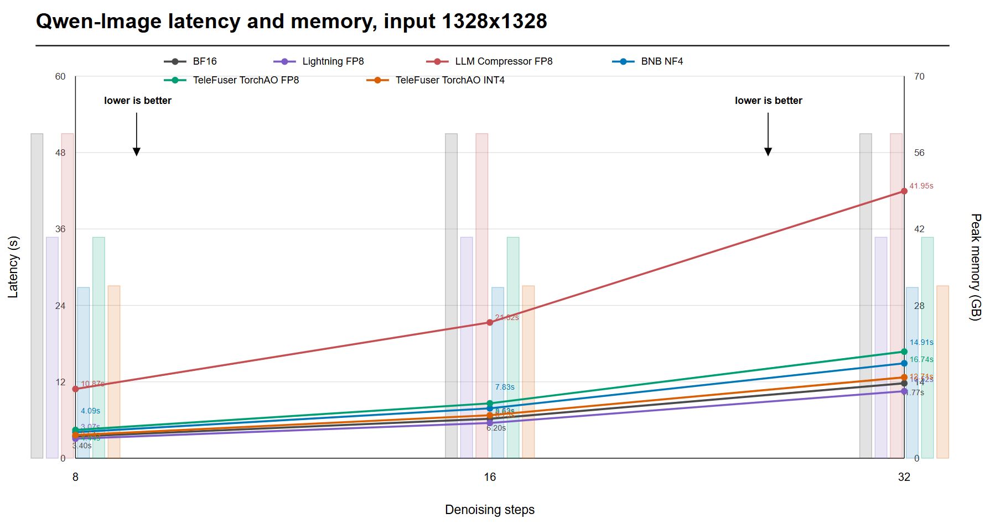
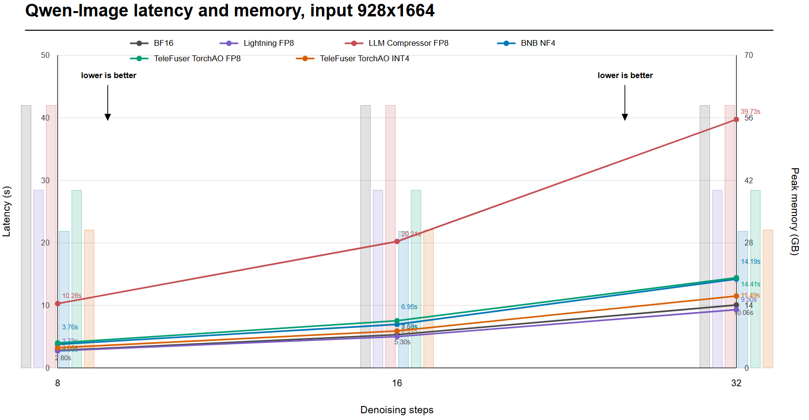
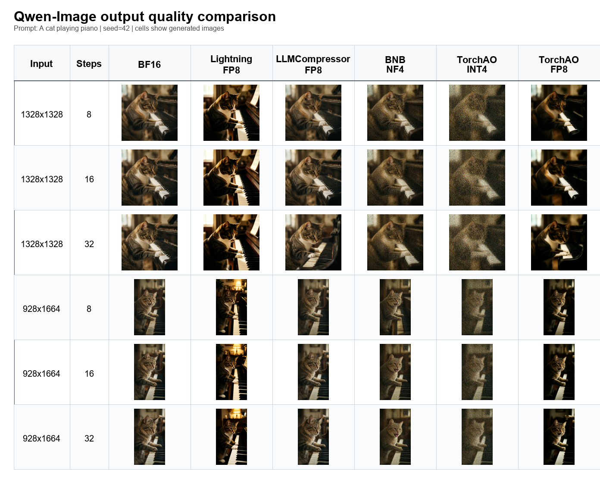

<!--
SECTION-CONTRACT
id: 04-online-quantization-qwen
role: Case study for generic online FP8/NF4 infrastructure.
sources: TeleFuser PR 16 and assets/*_result.json.
edit_scope: Keep Qwen-Image numbers tied to 1x H100, 1328x1328, 16 steps, 2 warmups, 5 repeats.
-->

# 4. Case I: Online Quantization as Infrastructure

**Source:** [TeleFuser PR #16, Support Online FP8 & NF4 Weight Quantization](https://github.com/Tele-AI/TeleFuser/pull/16)

The first contribution was not a custom kernel. It was a framework contract for
models that do not publish a pre-quantized checkpoint.

## Method

PR #16 added two runtime-selectable paths:

- **TorchAO FP8:** dynamic activation and FP8 weight quantization for W8A8
  Linear execution.
- **bitsandbytes NF4:** 4-bit NormalFloat weight storage with BF16 compute.

The implementation introduced quantization types and backend enums, model-level
`enable_quant()` dispatch, and Linear wrappers under `telefuser.ops`. The
module manager applies the transformation after loading so the same BF16
checkpoint can produce multiple deployment profiles. Qwen-Image, Wan, and LTX
model wrappers gained the common hook; Qwen-Image served as the measured case.

This separation matters. Quantization policy belongs to model configuration,
while backend-specific tensor packing and execution remain behind a Linear
contract. A new model can reuse the backend without copying a quantization
script into its pipeline.

## Evaluation protocol

- GPU: 1 x NVIDIA H100 80GB HBM3
- Model: Qwen-Image-2512
- Output: 1328 x 1328, batch size 1
- Sampling: 16 steps, seed 42
- Timing: 2 warmups followed by 5 measured repeats
- Compared profiles: BF16, Lightning FP8 checkpoint, online TorchAO FP8,
  BNB NF4, and TorchAO INT4

| Profile | Mean latency | Peak allocated memory | Relative interpretation |
|---|---:|---:|---|
| BF16 | 6.016 s | 59.47 GiB | Baseline |
| Lightning FP8 checkpoint | 5.501 s | 40.49 GiB | 8.5% lower latency, 31.9% less memory |
| Online TorchAO FP8 | 8.346 s | 40.48 GiB | 31.9% less memory, dynamic overhead visible |
| BNB NF4 | 7.751 s | **31.30 GiB** | 47.4% less memory, capacity-first path |
| TorchAO INT4 | 6.582 s | 31.58 GiB | Similar memory tier, weaker visual result |

The result establishes two different products. FP8 is a compute-capable format,
but an online generic implementation need not beat a model-specific checkpoint.
NF4 is the strongest memory reduction in this experiment, even though BF16
dequantized compute makes it slower than the baseline.

## Generated image evidence

The comparison motivated BNB NF4 over the measured TorchAO INT4 path: both
occupy a similar memory tier, while NF4 retains the prompt and composition more
faithfully in the qualitative sample. The online FP8 output remains close
enough to the checkpoint path to be useful when no quantized checkpoint exists.

## Lesson

Online quantization solves **availability** before it solves peak performance.
It gives every compatible BF16 checkpoint a lower-memory deployment path and
creates a stable control plane for later specialized kernels. The next case
shows why that infrastructure becomes essential for a model whose BF16 DiT
nearly fills an H100.
