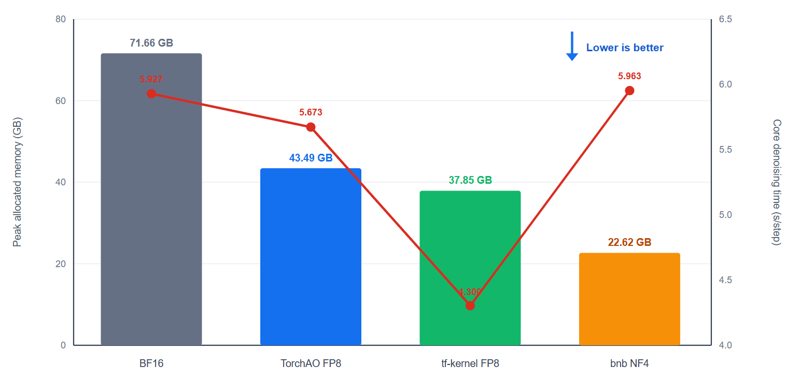
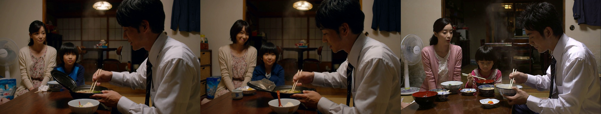

<!--
SECTION-CONTRACT
id: 05-online-quantization-h3
role: Case study for online quantization of MiniMax-H3.
sources: TeleFuser PR 25, final PR chart, local 50-step metrics and videos.
edit_scope: Keep the PR's matched tf-kernel-vs-TorchAO claim separate from later validation snapshots.
-->

# 5. Case II: Bringing Online Quantization to MiniMax-H3

**Source:** [TeleFuser PR #25, Enable Online FP8 & NF4 on MiniMax-H3](https://github.com/Tele-AI/TeleFuser/pull/25)

MiniMax-H3 turns online quantization from a convenience into a deployment
requirement. Its BF16 transformer consumes most of an 80GB H100 before the text
encoder, video/audio decoders, and intermediate activations are considered.

## Method

The H3 integration converts 258 Linear modules across the main transformer and
token-refiner blocks. It deliberately preserves the reference dtype for FP32
projections, the text encoder, and both VAEs. Quantization is exposed through
the standard FL2VA, Ref2VA, and JSON request examples rather than a detached
benchmark-only launcher.

Two engineering details prevent the online path from becoming a process-model
trap:

- FP8 Linear objects resolve the Python extension at runtime instead of storing
  an unpickleable module object in every instance.
- Multiprocess launch can begin from CPU weights and build device-local FP8
  caches after each worker owns its GPU, avoiding inherited parent-process CUDA
  tensors.

The original PR validates single-GPU CUDA and excludes FSDP quantization at load
time. Distributed FP8 attention is addressed separately in Case IV.

## Performance and lifecycle

The matched PR benchmark uses one H100, MiniMax-H3 FL2VA, 768p 16:9 output, a
five-second request, 50 steps, seed 0, and the ramen prompt shown below.

Within the matched FP8 backend comparison, tf-kernel reduces denoising time by
5.6% and peak allocated memory by 9.9% relative to TorchAO FP8. Its one-time
quantization is slower, however, so the first end-to-end request can still cost
more. This split between **materialization time** and **steady denoising time**
is why the blog reports both.

Separate validation snapshots show the capacity effect:

| Profile | Denoising time | Peak allocated |
|---|---:|---:|
| BF16 | 296.37 s | 66.74 GiB |
| TorchAO FP8 | 283.67 s | 40.51 GiB |
| BNB NF4 | 298.13 s | **21.07 GiB** |

These snapshots use a later software environment than the matched tf-kernel
pair and are included as deployment evidence, not as one combined ranking.

## Generated video and audio

Prompt:

> Steam rises from the ramen while the family talks in the background.

| Precision | PR-hosted player | Local evidence |
|---|---|---|
| BF16 | [play](https://github.com/user-attachments/assets/72afe0cf-99b0-4a07-903f-94a412ef43d9) | [MP4](assets/bf16.mp4) |
| TorchAO FP8 | [play](https://github.com/user-attachments/assets/1361ecb6-0a62-48a3-8b7b-2b3b9c7c55d5) | [MP4](assets/torchao-fp8.mp4) |
| BNB NF4 | [play](https://github.com/user-attachments/assets/1993e6c0-fe70-40bf-baed-8b16f6442fc3) | [MP4](assets/bnb-nf4.mp4) |
| tf-kernel FP8 | [play](https://github.com/user-attachments/assets/8e958cd5-3ad9-45fa-a3df-c9a4c103d098) | [MP4](assets/tf-kernel-fp8.mp4) |

The generated media changed the default recommendation. The measured tf-kernel
output was vivid but diverged from the prompt and BF16 trajectory. TorchAO FP8
was therefore the safer default while tf-kernel remained opt-in. This is an
important systems result: the fastest kernel cannot be the default until its
model-level quality boundary is understood.

## Lesson

Quantizing Linear layers makes H3 fit comfortably, but it leaves the
long-sequence attention products in BF16. The next case crosses that boundary.
