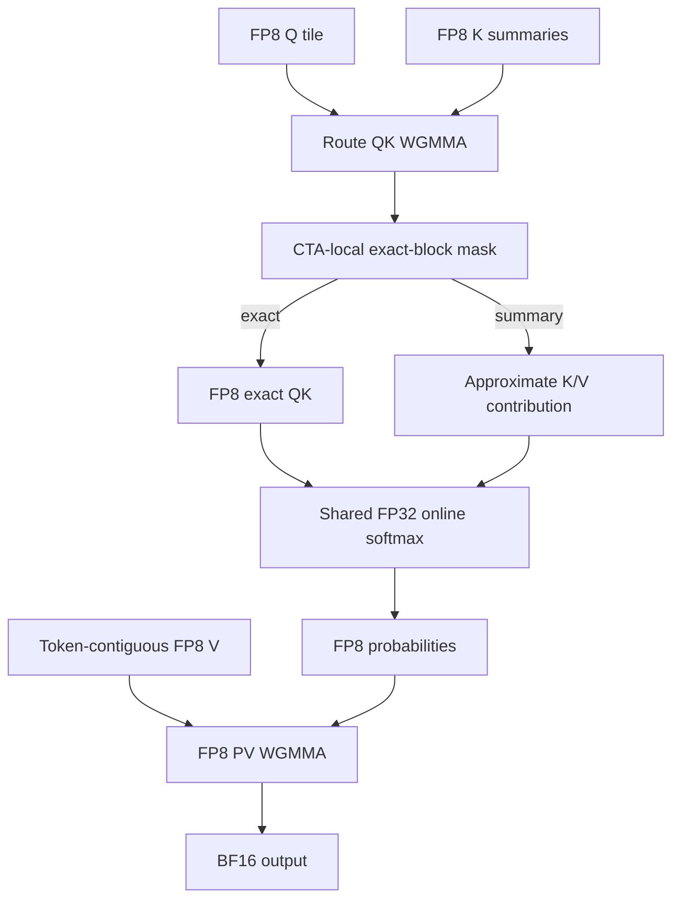
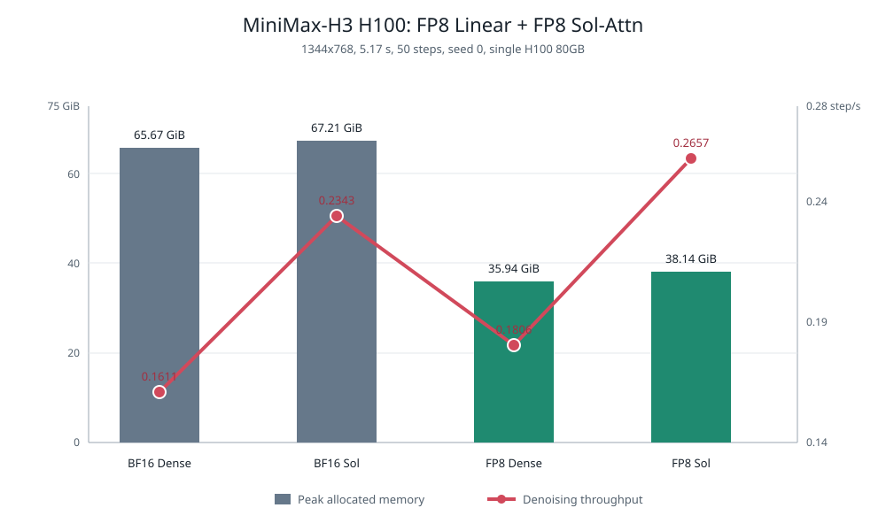
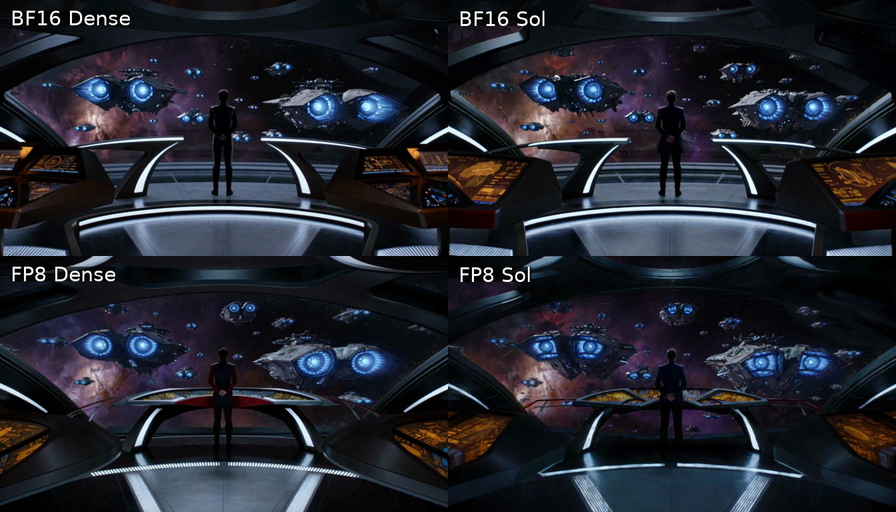
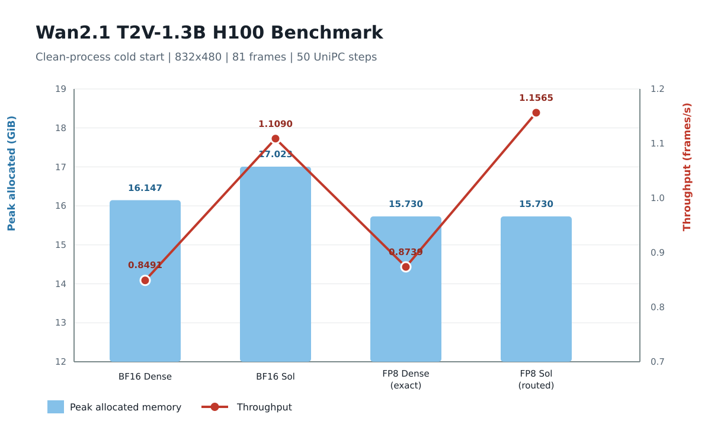
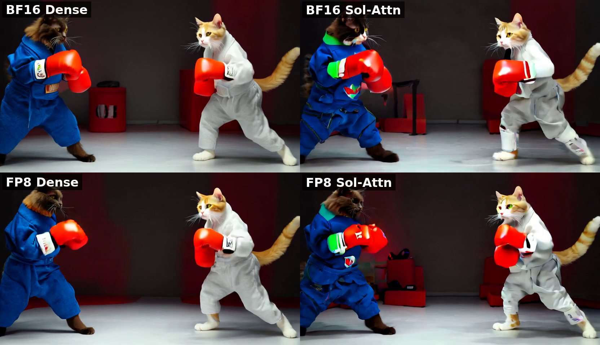

<!--
SECTION-CONTRACT
id: 06-fp8-sol-attention
role: Explain and evaluate native FP8 Sol-Attn.
sources: TeleFuser PR 30, final merged blog, H3 and Wan raw metrics.
edit_scope: Attribute Sol-Attn to prior work; TeleFuser claims integration and SM90 FP8 kernel engineering.
-->

# 6. Case III: Fusing FP8 with Dynamic Sparse Attention

**Source:** [TeleFuser PR #30, FP8 Sol-Attn](https://github.com/Tele-AI/TeleFuser/pull/30)

PR #30 combines two independent reductions: low-precision Linear GEMMs and
training-free sparse attention. The key is to keep Q/K/V in FP8 after their
attention-specific preparation instead of dequantizing at the kernel boundary.

## Shared QKV activation quantization

A conventional FP8 Linear wrapper quantizes the same hidden-state activation
once for each of Q, K, and V. TeleFuser quantizes it once and reuses the result
across three GEMMs. Q/K normalization and RoPE still execute in BF16. Only then
does the attention path create E4M3 operands.

For each batch, head, and 64-token block:

\[
s_q = \frac{\max |Q|}{448}, \qquad
s_k = \frac{\max |K|}{448}.
\]

V uses one scale per batch, head, and channel over the token dimension:

\[
s_{v,bhd} = \frac{\max_t |V_{bthd}|}{448}.
\]

The preparation writes V into token-contiguous backing storage for the PV
operand, avoiding a separate transpose before attention.

## Fused SM90 Sol mainloop

Sol-Attn partitions the sequence into 64-token Q and KV blocks. K/V block
summaries provide a routing proxy. A threshold \(\theta=\mu+\tau\sigma\)
promotes important blocks to exact attention; the remaining summaries
contribute an approximation to the same online-softmax state.

The Hopper specialization uses 64 x 64 tiles, head dimension 128, TMA movement,
WGMMA Tensor Cores, E4M3 QK/PV, FP32 accumulation, and BF16 output. Routing,
exact QK, summary correction, online softmax, and PV remain inside one mainloop,
so neither a full attention matrix nor a global route mask is written to HBM.

## Quality guards

Sparse and quantization errors compound across layers and denoising steps.
TeleFuser therefore exposes dense early timesteps, dense early layers, exact KV
sinks, and a half-open FP8 attention layer range. MiniMax-H3 keeps its
conditioning prefix exact and recomputes prefix queries with dense attention.
Wan applies FP8 attention only to layers 10-19 in the validated profile.

## Single-H100 evaluation

### MiniMax-H3 FL2VA

The cold-process workload uses 1344 x 768, 124 frames, 50 steps, seed 0, and the
official long starship prompt. Generation timing excludes MP4 serialization.

| Linear | Attention | Denoising | Throughput | Peak allocated |
|---|---|---:|---:|---:|
| BF16 | Dense FA4 | 310.41 s | 0.1611 step/s | 65.67 GiB |
| BF16 | Sol | 213.44 s | 0.2343 step/s | 67.21 GiB |
| FP8 | Dense FA4 | 276.84 s | 0.1806 step/s | 35.94 GiB |
| FP8 | FP8 Sol | **188.19 s** | **0.2657 step/s** | 38.14 GiB |

FP8 Sol raises denoising throughput by 65.0% and reduces peak allocated memory
by 41.9% versus BF16 Dense. Relative to FP8 Dense, sparsity adds 47.1%
throughput with a 6.1% memory increase. Sol's centroids, thresholds, route
state, LSE, and split-KV workspace explain why sparse attention is not
automatically a memory optimization.

| Profile | Local video |
|---|---|
| BF16 Dense | [MP4](assets/h3-bf16-dense.mp4) |
| BF16 Sol | [MP4](assets/h3-bf16-sol.mp4) |
| FP8 Dense | [MP4](assets/h3-fp8-dense.mp4) |
| FP8 Sol | [MP4](assets/h3-fp8-sol.mp4) |

### Wan2.1-T2V-1.3B

The validated Wan workload uses 832 x 480, 81 frames, 50 UniPC steps, seed 42,
and the boxing-cats prompt.

FP8 Sol is 36.2% faster than BF16 Dense and uses 2.6% less peak allocated
memory. FP8 Exact is only 2.9% faster than BF16 Dense, demonstrating how
conversion and launch costs can erase nominal Tensor Core gains on smaller
matrices.

| Profile | Local video |
|---|---|
| BF16 Dense | [MP4](assets/wan-bf16-dense.mp4) |
| BF16 Sol | [MP4](assets/wan-bf16-sol.mp4) |
| FP8 Dense | [MP4](assets/wan-fp8-dense.mp4) |
| FP8 Sol | [MP4](assets/wan-fp8-sol.mp4) |

The partial FP8 layer range was selected after all-layer FP8 attention showed
visible degradation. For the retained profile, the matching-attention
comparisons measured 22.03 dB PSNR / 0.8288 SSIM for FP8 Exact and 20.85 dB /
0.7927 for FP8 Sol.

## Lesson

The large gain comes from composing optimizations at their true boundary:
model memory and Linear bandwidth from FP8 weights, long-sequence compute from
Sol routing, and QK/PV throughput from an FP8-native attention mainloop.
