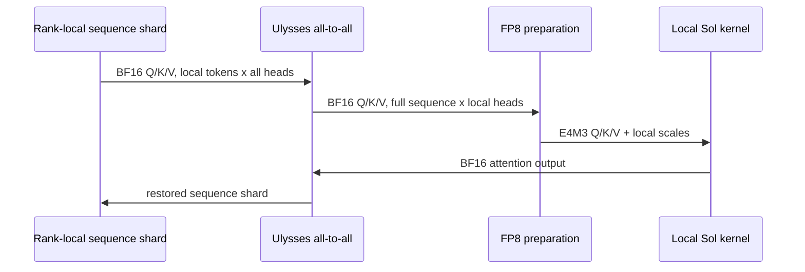
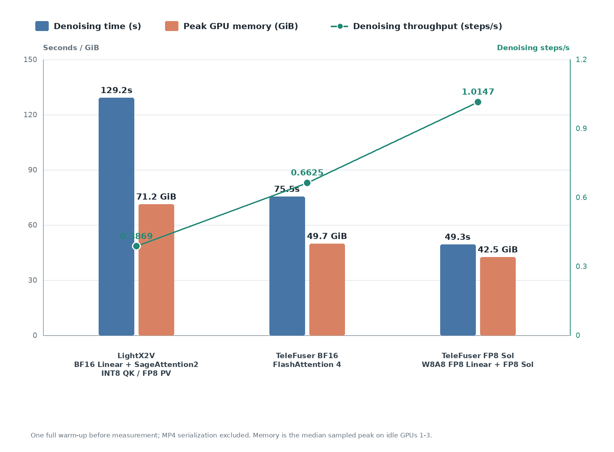
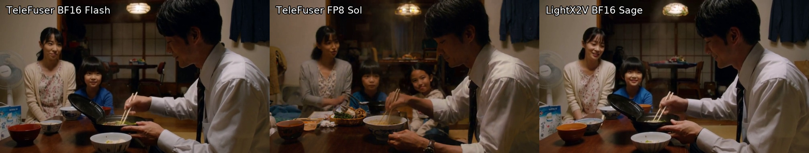

<!--
SECTION-CONTRACT
id: 07-sequence-parallel
role: Explain FP8 Sol under Ulysses sequence parallelism and its tuning.
sources: TeleFuser PR 35, benchmark README, four-GPU raw metrics.
edit_scope: Keep TeleFuser-vs-TeleFuser and TeleFuser-vs-LightX2V comparisons distinct.
-->

# 7. Case IV: Sequence-Parallel FP8 Sol

**Source:** [TeleFuser PR #35, Enable Sequence Parallelism on FP8 Sol-Attn](https://github.com/Tele-AI/TeleFuser/pull/35)

Single-GPU efficiency is not enough for longer clips or lower latency targets.
PR #35 composes native FP8 Sol with Ulysses sequence parallelism and validates
TP2 x SP2 MiniMax-H3 plus SP2/SP4 Wan.

## Why quantization moves after all-to-all

Ulysses begins with sequence-sharded, all-head Q/K/V. Its all-to-all exchanges
that layout for full-sequence, local-head tensors. Sol routing and Q/K block
scales need the full sequence consumed by each local attention kernel.
Therefore TeleFuser exchanges BF16 Q/K/V first, then computes FP8 scales and
runs Sol independently on every local head shard.

Quantizing before communication would attach a scale to one partition and then
rearrange the values into another. Dequantize/requantize could repair the
semantics, but it would add traffic and launches at the hottest boundary.

The same ownership rule explains timestep tensors. A scalar diffusion timestep
is global conditioning and remains replicated. A per-token timestep embedding
is sequence data and follows the token shard through the parallel transform.

## Ring versus Ulysses

Ulysses gives each rank the complete sequence, which fits Sol's local dynamic
router. Ring attention instead keeps a sequence shard and streams K/V blocks
between ranks while merging distributed log-sum-exp state. The current Sol
kernel does not expose that distributed online merge, so ring and combined
Ulysses-ring retain a dense fallback. This is an explicit capability boundary,
not an assertion that Ulysses is universally better.

## Process and cache correctness

Distributed launch also forced two lifecycle fixes:

- `FP8Linear` no longer stores a non-pickleable Python extension module in
  each instance; the backend is resolved in the worker at runtime.
- Multi-GPU Wan can spawn from CPU weights and construct FP8 caches lazily on
  each GPU, avoiding parent-process CUDA tensors that cannot be inherited by
  spawn workers.

These changes do not alter math, but without them the optimized kernel cannot
be deployed through Python multiprocessing.

## Tuning

The retained MiniMax-H3 profile uses `dense_steps=10`,
`dense_layers=2`, `tau=1.0`, and the exact threshold estimator. A
`tau=0.5/diag` candidate was slower end to end and did not improve decoded
similarity. Microbenchmarks from 4,096 to 65,536 global tokens show that two KV
splits remain optimal from 16,384 tokens upward; four splits lose to workspace
and reduction overhead even at the largest measured length.

## Four-H100 evaluation

The matched workload uses 4 x H100 80GB, TP2 x Ulysses SP2, T2VA 1344 x 768,
124 frames at 24 fps, 50 configured scheduler points, seed 0, one warmup, and
no feature cache. MP4 serialization is excluded.

Against TeleFuser BF16 + FlashAttention-4, FP8 Sol:

- reduces generation time from 78.51 s to 52.27 s, a 33.4% reduction;
- reduces denoising time from 75.47 s to 49.28 s;
- raises reported throughput from 0.6625 to 1.0147 step/s, a 53.2% gain; and
- reduces total sampled peak memory from 204,791 to 175,381 MiB, or 14.4%.

Against the deployed LightX2V stack, the same TeleFuser profile is 2.64x faster
end to end, 2.62x faster in denoising, and uses 40.3% less representative peak
GPU memory. LightX2V uses BF16 Linear weights with SageAttention2's quantized
INT8-QK/FP8-PV attention; it is not a BF16 attention baseline.

## Generated output

| Implementation | PR-hosted player | Local evidence |
|---|---|---|
| TeleFuser BF16 + FA4 | [play](https://github.com/user-attachments/assets/ddfaeef9-aa56-4611-b226-3ff7380da771) | [MP4](assets/telefuser-bf16-fa4.mp4) |
| TeleFuser FP8 Linear + FP8 Sol | [play](https://github.com/user-attachments/assets/2c042a75-1d93-4037-8a54-b57a19c59c76) | [MP4](assets/telefuser-fp8-sol.mp4) |
| LightX2V BF16 + SageAttention2 | [play](https://github.com/user-attachments/assets/ce865ab3-5961-45b7-bdcb-f0bbbf31648b) | [MP4](assets/lightx2v-sageattention2.mp4) |

All outputs are coherent family ramen scenes with valid H.264 video and AAC
audio. Different composition and person placement prevent a claim of numerical
output equivalence.

## Lesson

Parallelism changes the local mathematical object. Low-precision preparation
must be placed after the collective that defines that object, and kernel tuning
must include communication and reduction costs rather than only mainloop FLOPs.
