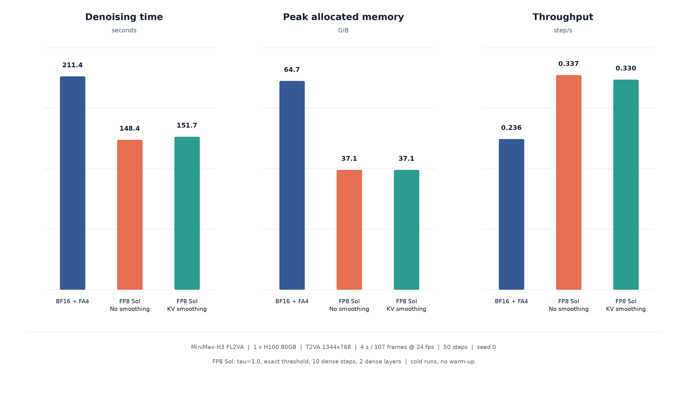
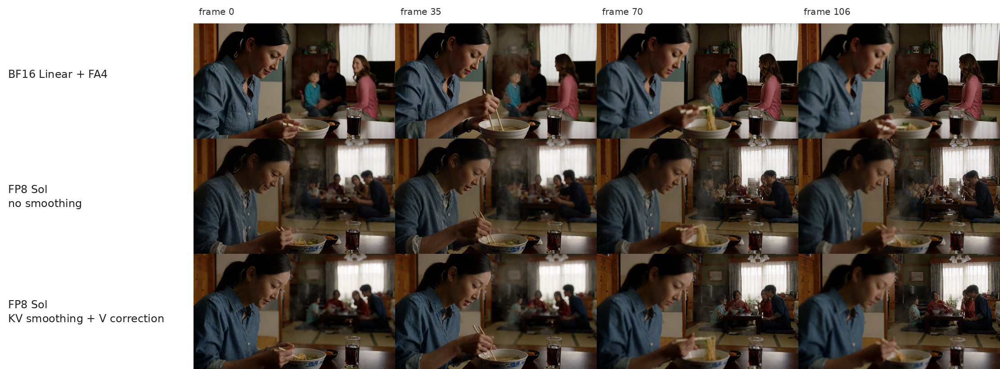

<!--
SECTION-CONTRACT
id: 08-attention-smoothing
role: Explain attention-equivalent smoothing, fused implementation, and quality evaluation.
sources: TeleFuser PR 40 and final local H3 metrics.
edit_scope: Claim video-metric improvement for the measured seed only; do not claim universal audio improvement.
-->

# 8. Case V: Recovering FP8 Quality with Attention-Equivalent Smoothing

**Source:** [TeleFuser PR #40, Attention Smoothing to Improve Generation Quality](https://github.com/Tele-AI/TeleFuser/pull/40)

The earlier quality guards decide **where** FP8 is allowed. PR #40 improves the
numerical distribution at the remaining FP8 attention boundary without changing
the full-precision attention function.

## K centering

For one head, let \(\mu_K\) be the sequence mean of K. Then:

\[
\operatorname{softmax}(Q(K-\mu_K)^T)
= \operatorname{softmax}(QK^T-Q\mu_K^T)
= \operatorname{softmax}(QK^T).
\]

For each query row, \(Q\mu_K^T\) is a scalar subtracted from every logit.
Softmax is shift invariant, so K can be centered in FP32 before E4M3
quantization without changing exact attention. The centered range is friendlier
to a finite quantization grid.

## V centering and bias correction

Let \(P=\operatorname{softmax}(QK^T)\) and \(\mu_V\) be V's sequence mean.
Since every row of P sums to one:

\[
P(V-\mu_V)+\mu_V=PV.
\]

TeleFuser centers V before quantization and restores its mean after attention.
E4M3 rounding can leave a residual per-head/channel mean in reconstructed
centered V, so the implementation measures that bias and corrects it at the
output boundary.

This is attention smoothing, not SmoothQuant: no scale is migrated between a
Linear activation and its weight.

## Fusing the added boundaries

An exact global mean can erase the gain if implemented as a chain of generic
reductions and elementwise kernels. The final path:

- computes exact K/V FP32 statistics in one Triton reduction;
- fuses centering into QKV quantization;
- merges V correction and BF16 dense-prefix replacement in one output pass.

At the live H3 shape, the fused implementation improves the combined
quantization/correction and output boundary from 3.4571 ms to 2.6594 ms, a
23.1% reduction. The constituent improvements are 47.3% for statistics, 18.4%
for smoothed QKV preparation/correction, and 36.9% for output correction plus
dense-prefix merge. GPU tests require bitwise equality with the unfused exact
implementation.

## Operator-level accuracy

Real post-QK-norm, post-RoPE Q/K/V were captured from the first active Sol
layer at shape `(1, 32626, 56, 128)`. Four heads cover the complete
32,626-token context, and dense attention output is evaluated at 64 evenly
spaced queries in FP32.

| Boundary | Unsmoothed MSE | Smoothed MSE | Reduction |
|---|---:|---:|---:|
| K quantization | 9.380e-4 | 7.349e-4 | **21.65%** |
| Reconstructed V | 1.647e-2 | 1.611e-2 | 2.17% |
| Reconstructed V mean bias | 1.044e-6 | 2.561e-14 | **>99.99999%** |
| Dense attention output | 7.034e-4 | 6.459e-4 | **8.18%** |

Attention-output cosine rises from 0.999403 to 0.999452, relative L2 falls from
0.03455 to 0.03311, and SQNR rises from 29.23 to 29.60 dB.

## End-to-end evaluation

The matched workload uses one H100, MiniMax-H3 FL2VA T2VA, 1344 x 768, 107
frames at 24 fps, 50 denoising steps, seed 0, exact threshold, 10 dense steps,
and 2 dense layers. FP8 profiles are cold processes measured twice.

The final smoothed profile remains 39.4% faster than BF16 and uses 42.6% less
peak allocated memory. Relative to unsmoothed FP8 Sol, exact smoothing adds
2.16% denoising time, reduces throughput by 2.11%, and leaves peak memory
unchanged at 37.11 GiB.

| Profile | Frame cosine | PSNR | SSIM mean / min |
|---|---:|---:|---:|
| FP8 Sol, no smoothing | 0.87488 | 14.695 dB | 0.5464 / 0.5151 |
| FP8 Sol, KV smoothing + V correction | **0.87729** | **14.800 dB** | **0.5659 / 0.5382** |

| Output | PR-hosted player | Local evidence |
|---|---|---|
| BF16 + FA4 | [play](https://github.com/user-attachments/assets/74dc0819-70f5-4122-90fd-66cdb8317c16) | [MP4](assets/bf16-fa4.mp4) |
| FP8 Sol, unsmoothed | [play](https://github.com/user-attachments/assets/04939f60-cf11-4b29-9f33-5940d8a5f1e8) | [MP4](assets/fp8-sol-unsmoothed.mp4) |
| FP8 Sol, smoothed | [play](https://github.com/user-attachments/assets/221aa0f5-a0b6-4826-a6cb-1e238b3a8152) | [MP4](assets/fp8-sol-smoothed.mp4) |

Smoothing improves every reported video trajectory metric for this seed. The
unsmoothed output remains closer to BF16 on the measured audio cosine, SI-SDR,
and log-spectral distance, so the result does not claim a universal audio
improvement.

## Lesson

Algebraic equivalence is a practical quantization tool. It can reshape a tensor
before rounding while preserving the exact function, but only a fused
implementation keeps the quality fix on the performance frontier.
