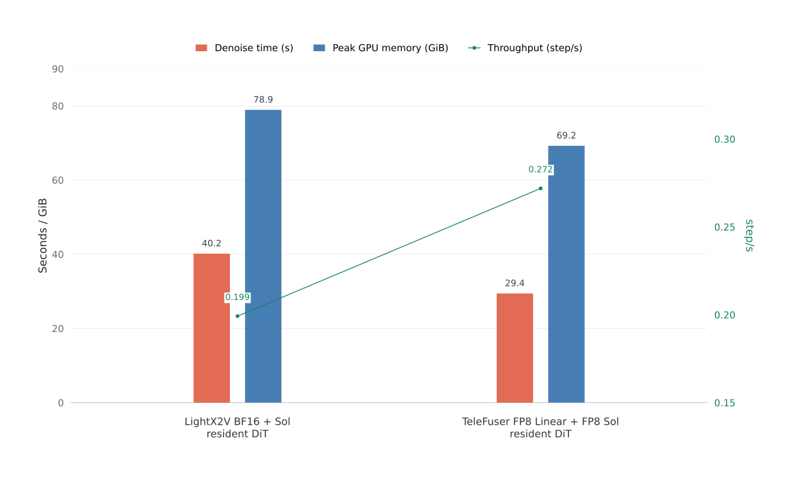
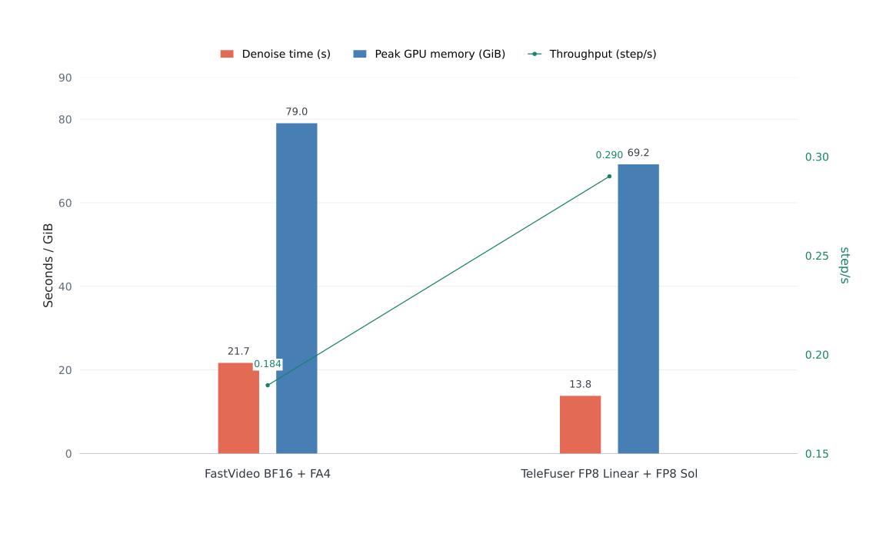
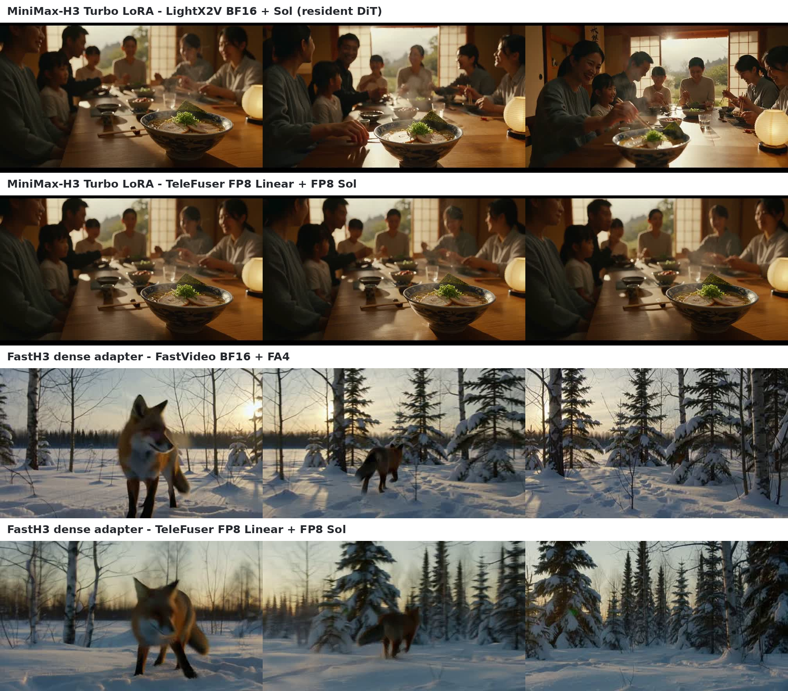

<!--
SECTION-CONTRACT
id: 09-adapters
role: Explain adapter formats, merge ordering, rejection policy, and final benchmarks.
sources: TeleFuser PR 44 and final PR artifacts.
edit_scope: Use LightX2V for Turbo and FastVideo for FastH3; PR 40 smoothing is intentionally excluded.
-->

# 9. Case VI: Adapter-Aware FP8 Deployment

**Source:** [TeleFuser PR #44, MiniMax-H3 and FastH3 LoRA/FP8 Adapter Support](https://github.com/Tele-AI/TeleFuser/pull/44)

Adapters mutate the effective model, so they must be part of the optimized
weight lifecycle. PR #44 supports two released families over the MiniMax-H3
base while deliberately excluding the unmerged attention-smoothing branch.

## Two adapter contracts

**MiniMax-H3 Turbo LoRA** is a conventional low-rank update with the publisher's
alpha/rank convention. **FastH3 dense-datafree** identifies itself as
`fastvideo-lora-v2` and combines 362 A/B low-rank pairs with 85 exact
`.diff`, `.diff_b`, and `.diff_m` residuals. TeleFuser applies all 447
FastH3 adjustments.

The loader streams each update, computes it in FP32, adds it to the original
BF16 weight, and only then materializes an FP8 cache:

\[
W_{\mathrm{FP8}} =
Q_{\mathrm{E4M3}}\left(W_{\mathrm{BF16}} +
\lambda\Delta W_{\mathrm{adapter}}\right).
\]

Quantizing before the merge would either leave stale cached weights or require
dequantize-update-requantize cycles with extra error. FastH3's released
low-rank contract uses \(W \leftarrow W + BA\) without an implicit alpha/rank
factor; Turbo retains its own scaling behavior.

VSA adapter files additionally contain learned `.set_weight` compression-gate
replacements. The FP8 Sol backend cannot represent those gates, so TeleFuser
rejects the file with an actionable error instead of silently applying only
part of the model.

## MiniMax-H3 Turbo

The matched workload uses one H100, 1344 x 768, 124 frames, 8 DiT updates,
FP8 Linear + FP8 Sol, `dense_steps=1`, `dense_layers=0`, exact routing,
one warmup, and three measured runs.

The canonical ModelTC Diffusers script was tested first, but at this workload it
OOMs during the first DiT update: 78.28 GiB is already in use before a 1.06 GiB
FFN allocation. The completed baseline therefore uses the publisher team's
LightX2V BF16 Sol example with only configuration changes and a resident DiT.
CPU-offload results are diagnostic and excluded from the chart.

TeleFuser reduces median denoising time from 40.15 s to 29.42 s, a 26.7%
reduction, and raises actual-update throughput by 36.5%. Its whole-process peak
is 69.23 GiB versus 78.91 GiB for the resident LightX2V baseline.

## FastH3 dense adapter

The direct comparison uses the same dense adapter, prompt, seed, output, and
four DiT updates. FastVideo's official dense LoRA example uses BF16 + FA4. Its
generic FP8 option fails before warmup because conversion removes the
`ReplicatedLinear.weight` expected by constructor-time LoRA conversion; the
baseline remains BF16 because no FastVideo source change is allowed.

TeleFuser records 13.79 s median denoising versus 21.69 s for FastVideo, a 36.4%
reduction. Using each framework's five scheduler-point convention, throughput
improves by 57.2%. Both profiles execute four actual transformer updates.

## Generated video and audio

All four outputs contain 124 H.264 frames at 1344 x 768 with synchronized stereo
AAC audio.

| Workload | Implementation | PR-hosted player | Local evidence |
|---|---|---|---|
| Turbo | LightX2V BF16 + Sol | [play](https://github.com/user-attachments/assets/aefb292d-bfa8-43d1-81f0-48b88892c4af) | [MP4](assets/turbo-lightx2v-bf16-sol.mp4) |
| Turbo | TeleFuser FP8 + Sol | [play](https://github.com/user-attachments/assets/8bd84bf0-a3c6-45dd-a6f0-6d978aaa167d) | [MP4](assets/turbo-telefuser-fp8-sol.mp4) |
| FastH3 | FastVideo BF16 + FA4 | [play](https://github.com/user-attachments/assets/e63ab16b-d9ec-455c-8452-f206afcaeb17) | [MP4](assets/fasth3-fastvideo-bf16-fa4.mp4) |
| FastH3 | TeleFuser FP8 + Sol | [play](https://github.com/user-attachments/assets/e441a17d-a6f9-47bd-abb5-a07eb5e33822) | [MP4](assets/fasth3-telefuser-fp8-sol.mp4) |

## Why FP8 peak memory is not half of BF16

After warmup, FP8 materialization, garbage collection, cache clearing, and peak
reset, the Turbo transformer contains 208 FP8 Linear layers, no retained source
BF16 weights, and only 53.6 MiB of BF16 transformer tensors. The 69.23 GiB
whole-process peak occurs during text encoding: a 23.58 GiB resident FP8 DiT
overlaps roughly 45.65 GiB of encoder allocation. Denoising itself peaks near
31.93 GiB.

The result is therefore not evidence that BF16 weights were accidentally kept.
It shows that end-to-end peak memory is the maximum of overlapping pipeline
phases, not a direct dtype ratio. LightX2V's much smaller offload peak comes
from moving the DiT over PCIe and pays for that choice in latency.

## Lesson

Efficient adapters require semantic loading, not filename compatibility. Merge
ordering, scaling conventions, exact residuals, and unsupported learned gates
all affect the final model seen by the FP8 kernel.
